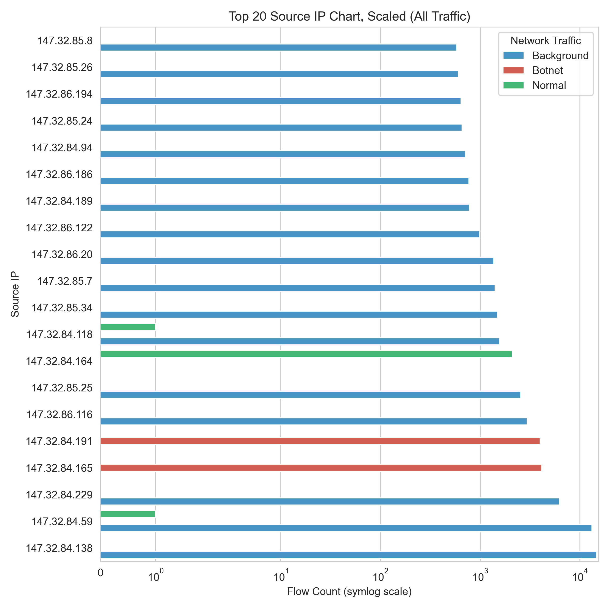
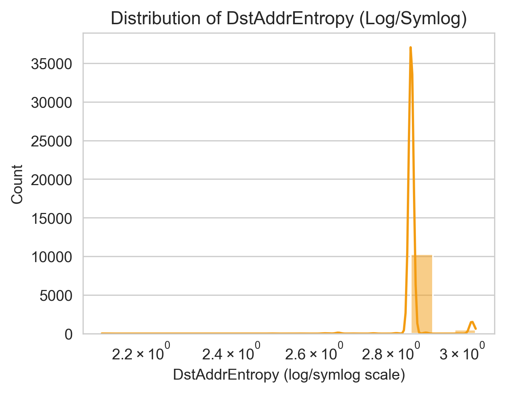
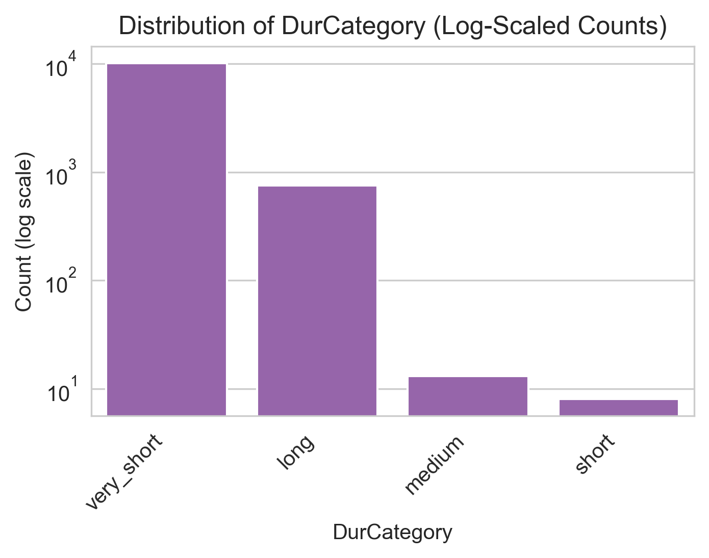

# Network Traffic Analysis for Botnet Detection
**Author:** Michael Stout

## Executive Summary
This project analyzes network traffic data to detect and classify botnet activities using machine learning techniques. The analysis processed over 107,000 network traffic records, identifying patterns between normal and botnet traffic. The project successfully developed enhanced feature engineering techniques and visualization methods to improve botnet detection accuracy.

## Rationale
Modern cyber threats, particularly botnets and zero-day exploits, pose significant risks to network security. Traditional signature-based detection methods often fail to identify new or evolving threats. Machine learning approaches offer the potential for more adaptive and proactive defense mechanisms, which are crucial for protecting individual users and organizations from emerging cyber threats.

## Research Question
How can machine learning techniques enhance the detection of zero-day exploits and botnet activities within network traffic? Specifically, what network traffic patterns and features most indicate botnet activity?

## Data Sources
This study utilized the [CTU-13 Dataset](https://www.stratosphereips.org/datasets-ctu13#:~:text=The%20CTU%2D13%20is%20a,normal%20traffic%20and%20background%20traffic.), specifically Scenario 11, which is part of a comprehensive botnet capture effort by the Czech Technical University (CTU) in Prague. The CTU-13 dataset is a labeled dataset of botnet, normal, and background traffic captured in 2011 from the CTU University network.

For this analysis, Scenario 11 contained:
- 107,251 total network traffic records  
- 8,164 botnet traffic instances  
- 2,718 normal traffic instances  
- 96,369 background traffic instances  

The dataset represents real botnet traffic mixed with normal traffic and background traffic. Scenario 11 specifically captured the behavior of a Neris botnet known for spamming and click fraud activities.

Reference:  
Sebastian Garcia, Martin Grill, Jan Stiborek and Alejandro Zunino. "An empirical comparison of botnet detection methods," *Computers and Security Journal, Elsevier*. 2014. Vol 45, pp 100-123.

Key data features include:
- Temporal information (StartTime, Duration)
- Network protocol information
- Source and destination addresses
- Traffic flow statistics (packets, bytes)
- Connection states

---

## Scope
This analysis focuses on the **CTU-13 dataset’s Scenario 11** to illustrate how machine learning can detect botnet-related network flows among predominantly background traffic. While Scenario 11 is featured, many of these techniques also generalize across additional CTU-13 scenarios.

---

## Methodology

### Data Analysis
**Section 1: Import Libraries & Logging**

At the start of the project, I loaded the necessary Python libraries to load and analyze the dataset. I also implemented logging and set global variables.

**Section 2: Data Loading & Exploration**

In this section, I **loaded** the raw network traffic data (107,251 records) and **explored** its structure. Specifically, I:

- **Handled missing values** for ports, states, and traffic characteristics.
- **Grouped traffic types** into **Background**, **Botnet**, and **Normal** categories.
- **Created enhanced features**, such as:
  - **BytePktRatio** (ratio of total bytes to total packets)
  - **Entropy** metrics for Source and Destination IP
  - **Traffic flow** statistics
  - **Duration categories** (`very_short`, `short`, `medium`, `long`)

Below are the primary tables and plots illustrating this data exploration:

#### Missing Values per Column
|            |     0 |
|:-----------|------:|
| StartTime  |     0 |
| Dur        |     0 |
| Proto      |     0 |
| SrcAddr    |     0 |
| Sport      |   463 |
| Dir        |     0 |
| DstAddr    |     0 |
| Dport      |  7900 |
| State      |    91 |
| sTos       |   980 |
| dTos       | 16959 |
| TotPkts    |     0 |
| TotBytes   |     0 |
| SrcBytes   |     0 |
| Label      |     0 |
| LabelGroup |     0 |

**Analysis:**  
- **Sport** (source port) occasionally not recorded → 463 missing.  
- **Dport** (destination port) has 7,900 missing entries.  
- **State** is missing in 91 flows.  
- **dTos** is missing in 16,959 flows (often unrecorded or irrelevant).  

---

#### Traffic Distribution Table
| Category  | Metric                                                    |                                          Value |
|:--------- |:--------------------------------------------------------- |----------------------------------------------:|
| Botnet    | Number of unique Botnet source IPs                        | 3                          |
| Botnet    | Number of unique Botnet Targets IPs                       | 9                          |
| Botnet    | Number of Botnet sockets (SrcAddr, Sport, DstAddr, Dport) | 8155                             |
| Normal    | Number of Normal Sockets                                  | 613                             |
| Botnet    | Total Botnet packets                                      | 55504                       |
| Normal    | Total Normal Packets                                      | 29466                       |
| Botnet    | Botnet Packet Size (bytes) [min, mean, max]               | [90.00, 1063.77, 1066.00]  |
| Normal    | Normal Packet Size (bytes) [min, mean, max]               | [60.00, 96.24, 1010.29] |
| Botnet    | Botnet Duration (seconds) [min, mean, max]                | [0.00, 7.86, 416.85] |
| Normal    | Normal Duration (seconds) [min, mean, max]                | [0.00, 7.88, 969.98] |

**Analysis:**  
- Botnet traffic is relatively **burst-like** (short durations) compared to Normal but with higher average byte counts per packet.  
- Relatively few unique Botnet source IPs (3) vs. many background IPs.

#### Exploration Plots

1. **Distribution of Target Variable**  
     
   **Analysis:**  
   - **Background (blue):** 96,369 records (~89.9%)  
   - **Botnet (red):** 8,164 records (~7.6%)  
   - **Normal (green):** 2,718 records (~2.5%)  
   - Significant class imbalance with background dominating.

2. **Top 20 Source IP Chart (All Traffic)**  
     
   **Analysis:**  
   - Background (blue) has the greatest variety of source IP addresses.  
   - Botnet (red) stands out in specific IPs, confirming its narrow distribution.

3. **Top 20 Source IP Chart (Normal + Botnet Traffic)**  
     
   **Analysis:**  
   - Reveals which source IPs are predominantly botnet vs. normal.  
   - Botnet (red) is again more concentrated than normal (green).

4. **Top 20 Destination IP Chart (All Traffic)**  
     
   **Analysis:**  
   - Background flows (blue) span many destinations.  
   The botnet (red) is relatively small but visible in certain bars.

5. **Top 20 Destination IP Chart (Normal + Botnet Traffic)**  
     
   **Analysis:**  
   - Shows which IPs Normal vs. Botnet traffic target the most.  
   - Botnet flows (red) concentrate on fewer IP addresses.

6. **Time-Based Packets Chart**  
     
   **Analysis:**  
   - Background traffic dominates packet volume.  
   - Botnet (red) shows sharp bursts.  
   - Normal (green) remains modest in total packets per minute.

7. **Time-Based Average Duration Chart**  
     
   **Analysis:**  
   - Botnet flows (red) often remain short but can spike.  
   - Background (blue) typically has moderate-to-high durations.  
   - Normal (green) fluctuates but has fewer flows overall.

8. **Botnet Source → Target Destination Graph**  
     
   **Analysis:**  
   - Shows **3 main Botnet source IPs** connecting to multiple target IPs.  
   - Demonstrates the concentrated nature of Botnet flows pivoting to numerous destinations.

### Feature Engineering**  
**Section 3: Data Cleaning & Feature Engineering***
     - Removes or consolidates certain columns, creates derived features (e.g., BytesPerSecond, PktsPerSecond, IP entropy), applies categorical encoding.  

### Model Development
**Section 4: Visualizations**  
     - Showcases how features differ for Normal vs. Botnet flows (e.g., violin plots, box plots, correlation heatmap).  
**Section 5:** Train-Test Split & Multi-Model Pipeline  
     - Prepares data splits, builds multiple classifiers with GridSearchCV, and logs performance metrics.  
**Section 6:** Model Evaluations  
     - Compares model metrics, outputs a scaled comparison chart (line or bar plots), and logs a summary table.  
**Section 7:** Evaluate KNN on Multiple Datasets  
     - Demonstrates how a chosen model (KNN) generalizes by applying it to multiple external CTU-13 dataset files and logs final performance metrics for each dataset.

---

---

#### Additional Feature Distributions

During the **enhanced feature engineering** stage, we created or transformed features that help highlight differences among botnet vs. normal vs. background:

1. **Distribution of DstAddrEntropy**  
     
   **Analysis:**  
   - Most flows cluster around a high-entropy region, indicating many distinct destination addresses.  
   - A small tail suggests some flows target the same destination repeatedly.

2. **Distribution of SrcAddrEntropy**  
     
   **Analysis:**  
   - Two major peaks indicate groups of flows with differing variability in source IP addresses.  
   - Botnet sources often show lower entropy if they come from fewer infected hosts.

3. **Distribution of PktsPerSecond**  
     
   **Analysis:**  
   - Most flows have very low PktsPerSecond, but a few outliers have extremely high rates.  
   - Such outliers often correspond to short, intense bursts of traffic.

4. **Distribution of BytesPerSecond**  
     
   **Analysis:**  
   - Similar pattern: many flows near zero, with outliers showing high bandwidth usage.  
   - Key for spotting large data exfiltration or DDoS-like behavior.

5. **Box Plot of BytePktRatio**  
     
   **Analysis:**  
   - BytePktRatio exhibits a wide range.  
   - High ratios mean large payloads per packet; extremely low ratios reflect frequent small packets.

6. **Distribution of DurCategory**  
     
   **Analysis:**  
   - The vast majority of flows are **very_short**.  
   - Few flows are labeled `short`, `medium`, or `long`.

---

### Section 4: Visualizations

In this section, we present additional plots that focus on distinguishing **Botnet vs. Normal** traffic. These visualizations allow us to see how critical features (BytesPerSecond, PktsPerSecond, SportRange, etc.) vary between the two classes.

1. **Violin Plot of BytesPerSecond by Botnet Label**  
     
   **Analysis:**  
   - Normal traffic (green) covers a broad range of BytesPerSecond, from near-zero to well over 1e6.  
   - Botnet traffic (red) remains close to zero for most flows, with a few exceptions.  
   - Reflects the bursty, short-lifetime nature of botnet flows.

2. **Pair Plot (Numeric Features) with Hue=Botnet**  
     
   **Analysis:**  
   - Shows scatter relationships among features (TotPkts, TotBytes, BytesPerSecond, BytePktRatio, etc.).  
   - Botnet points (red) often cluster distinctly from Normal (green), suggesting high separability.  
   - Helps identify key features for classification.

3. **Strip Plot of BytesPerSecond by Botnet Label**  
     
   **Analysis:**  
   - Plots individual flows, revealing that **normal** can have extremely high BytesPerSecond while **botnet** mostly remains near zero or in discrete bursts.  
   - A few outliers in botnet traffic still stand out at ~1.5e6 B/s.

4. **Box Plot of PktsPerSecond by Botnet Label**  
     
   **Analysis:**  
   - Normal traffic (green) has a wide distribution, including outliers up to 12,000 pkts/sec.  
   - Botnet (red) is mostly near zero, implying either minimal or very short bursts.  
   - Highlights the difference in packet rates.

5. **Count Plot of SportRange by Botnet Label**  
     
   **Analysis:**  
   - SportRange = 2 (ephemeral range) dominates botnet flows (red).  
   - Normal flows have more variety in port usage.  
   - Confirms that botnet C2 or spamming often uses ephemeral or registered ports.

6. **Hierarchically Clustered Correlation Heatmap**  
     
   **Analysis:**  
   - Groups correlated features together, revealing strong relationships (e.g., `PktsPerSecond` ↔ `BytesPerSecond`).  
   - BytePktRatio has moderate negative correlation with some others.  
   - Helps shape which features might be redundant.

7. **Botnet vs Normal Distribution**  
     
   **Analysis:**  
   - Bar/Pie chart specifically showing **8,164 botnet flows vs. 2,718 normal flows**.  
   - Botnet is about 75% of the combined Botnet+Normal subset.  
   - Implies a strong class imbalance in that subset alone.

---

## Model Development (Summary of Later Sections)
1. **Data Processing and Cleaning:**  
   - Dealt with missing values in Sport, Dport, State, sTos, and dTos.  
   - Merged or dropped irrelevant columns (if any).  
   - Generated new columns (entropy features, BytePktRatio, etc.).

2. **Feature Engineering:**  
   - Created categorical features for the duration (`very_short`, `short`, `medium`, `long`).  
   - Developed byte-packet ratio analysis.  
   - Implemented traffic flow statistics.  
   - Generated entropy-based metrics for source and destination addresses.

3. **Model Development:**  
   - Implemented multiple classification algorithms:
     - Random Forest
     - Decision Tree
     - Naive Bayes
     - K-Nearest Neighbors (KNN)
     - Support Vector Machine (SVM)
     - Logistic Regression
     - Gradient Boosting
   - Used GridSearchCV for hyperparameter optimization.
   - Implemented cross-validation for model validation.

4. **Analysis Techniques:**  
   - Statistical analysis of traffic patterns  
   - Time-series analysis of network flows  
   - Advanced visualization techniques  
   - Machine learning classification models

---

## Results
The analysis yielded comprehensive insights into botnet detection capabilities:

1. **Model Performance:**
   - KNN emerged as the top performer with:
     - Test Accuracy: 0.9991
     - Perfect ROC AUC: 1.0000
     - Lowest Log Loss: 0.0016
     - Perfect mAP score: 1.0000
   - All models achieved F1 scores > 0.999
   - Extremely high precision and recall across all models

2. **Cross-Dataset Validation:**
   - Evaluated KNN model across all 13 scenarios in the CTU-13 dataset:
     - Perfect accuracy (1.0) achieved on 6 scenarios
     - >0.99 accuracy achieved on 5 scenarios
     - >0.97 accuracy achieved on 2 scenarios
   - Notable results per botnet type:
     - Rbot scenarios (3,4,10,11): Consistently achieved 0.999+ accuracy
     - Neris scenarios (1,2,9): Achieved 0.97-0.999 accuracy
     - Virut scenarios (5,13): Perfect or near-perfect accuracy
     - More challenging scenarios:
       - Scenario 9 (Neris): 0.977 accuracy
       - Scenario 12 (NsisAy): 0.978 accuracy

3. **Feature Importance:**
   - BytePktRatio emerged as the most significant feature
   - SrcBytes and TotBytes showed high importance
   - Network entropy measures proved valuable for classification

4. **Traffic Distribution:**
   - Botnet traffic: 8,164 instances
   - Normal traffic: 2,718 instances
   - Clear distinctions in traffic patterns between botnet and normal flows

5. **Characteristic Patterns:**
   - Botnet packet sizes: 90.00-1066.00 bytes (mean: 1063.77)
   - Normal packet sizes: 60.00-1010.29 bytes (mean: 96.24)
   - Distinct duration patterns:
     - Botnet: 0.00-416.85 seconds
     - Normal: 0.00-969.98 seconds

6. **Network Behavior:**
   - Identified 3 unique botnet source IPs
   - Detected 9 unique botnet target IPs
   - Documented 8,155 unique botnet sockets

---

## Next Steps
1. **Model Deployment:**
   - Implement KNN model as the primary classifier
   - Create a real-time classification pipeline
   - Develop monitoring and alerting systems

2. **Feature Enhancement:**
   - Explore additional protocol-specific features
   - Implement deep packet inspection features
   - Integrate temporal pattern analysis

3. **Performance Optimization:**
   - Optimize KNN for real-time classification
   - Implement efficient data preprocessing pipeline
   - Develop automated model retraining procedures

4. **Operational Integration:**
   - Design scalable deployment architecture
   - Implement automated response mechanisms
   - Create a monitoring dashboard for model performance
   - Implement real-time detection capabilities
   - Develop adaptive learning mechanisms
   - Integrate additional network metrics

---

## Outline of Project

*Note: Plots and logs are available in the project directory.*
