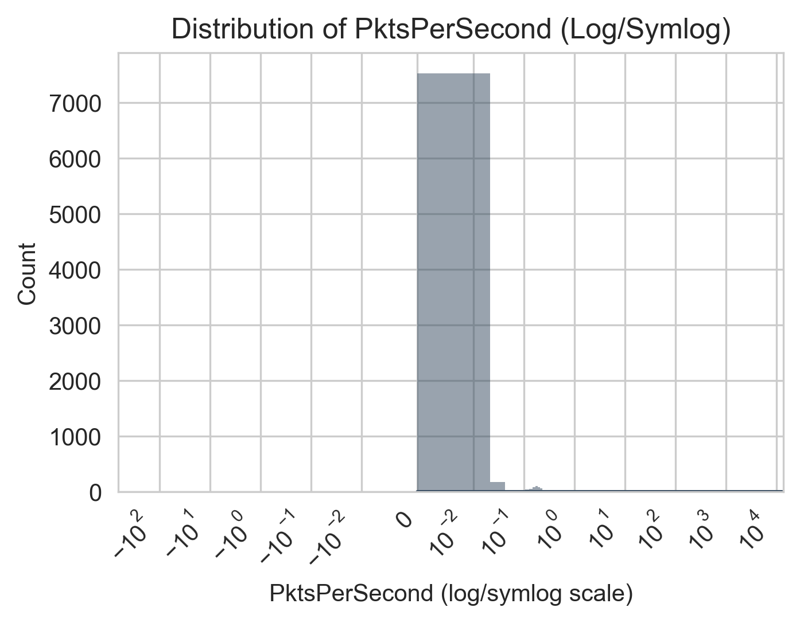
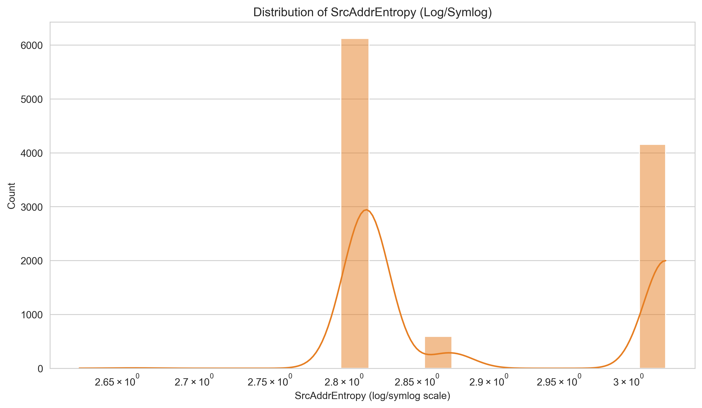

# Network Traffic Analysis for Botnet Detection
**Author:** Michael Stout

## Executive Summary
This project analyzes network traffic data to detect botnet activities using machine learning techniques. The analysis processed over 107,000 network traffic records, identifying patterns between normal and botnet traffic. The project successfully developed enhanced feature engineering techniques and visualization methods to improve botnet detection accuracy.

## Rationale
Modern cyber threats, particularly botnets and zero-day exploits, pose significant risks to network security. Traditional signature-based detection methods often fail to identify new or evolving threats. Machine learning approaches offer the potential for more adaptive and proactive defense mechanisms, which are crucial for protecting individual users and organizations from emerging cyber threats.

## Research Question
Can machine learning techniques enhance the detection of zero-day exploits and botnet activities within network traffic by looking at network traffic patterns to identify malicous activity?

## Data Sources
This study utilized the [CTU-13 Dataset](https://www.stratosphereips.org/datasets-ctu13#:~:text=The%20CTU%2D13%20is%20a,normal%20traffic%20and%20background%20traffic.), specifically Scenario 11, which is part of a comprehensive botnet capture effort by the Czech Technical University (CTU) in Prague. The CTU-13 dataset is a labeled dataset of botnet, normal, and background traffic captured in 2011 from the CTU University network.

For this analysis, Scenario 11 contained:
- 107,251 total network traffic records  
- 8,164 botnet traffic instances  
- 2,718 normal traffic instances  
- 96,369 background traffic instances  

The dataset represents real botnet traffic mixed with normal traffic and background traffic. Scenario 11 specifically captured the behavior of Rbot, a family of malware known for its backdoor capabilities and use in creating botnets.

Reference:  Sebastian Garcia, Martin Grill, Jan Stiborek and Alejandro Zunino. "An empirical comparison of botnet detection methods," *Computers and Security Journal, Elsevier*. 2014. Vol 45, pp 100-123.

## Scope
This analysis focuses on the **CTU-13 dataset’s Scenario 11** to illustrate how machine learning can detect botnet-related network flows among predominantly background traffic. While Scenario 11 is featured, many of these techniques also generalize across additional CTU-13 scenarios.

## Methodology

### Data Analysis
**Section 1: Import Libraries & Logging**

At the start of the project, I loaded the necessary Python libraries to load and analyze the dataset. I also implemented logging and set global variables.

**Section 2: Data Loading & Exploration**

In this section, I loaded the network traffic data (107,251 records) and explored its structure. 

In my initial analysis, I discovered the following.

1. Traffic Distribution
2. Missing Values
3. Traffic Types
4. Traffic Characteristics

#### Traffic Distribution
| Category  | Metric                                                    |                                          Value |
|:--------- |:--------------------------------------------------------- |----------------------------------------------:|
| Botnet    | Number of unique Botnet source IPs                        | 3                          |
| Botnet    | Number of unique Botnet Targets IPs                       | 9                          |
| Botnet    | Number of Botnet sockets (SrcAddr, Sport, DstAddr, Dport) | 8155                             |
| Normal    | Number of Normal Sockets                                  | 613                             |
| Botnet    | Total Botnet packets                                      | 55504                       |
| Normal    | Total Normal Packets                                      | 29466                       |
| Botnet    | Botnet Packet Size (bytes) [min, mean, max]               | [90.00, 1063.77, 1066.00]  |
| Normal    | Normal Packet Size (bytes) [min, mean, max]               | [60.00, 96.24, 1010.29] |
| Botnet    | Botnet Duration (seconds) [min, mean, max]                | [0.00, 7.86, 416.85] |
| Normal    | Normal Duration (seconds) [min, mean, max]                | [0.00, 7.88, 969.98] |

#### Missing Values
|:-----------|------:|
| Sport      |   463 |
| Dport      |  7900 |
| State      |    91 |
| sTos       |   980 |
| dTos       | 16959 |

Analysis:
- Sport (source port) occasionally not recorded → 463 missing.  
- Dport (destination port) has 7,900 missing entries.  
- State is missing in 91 flows.  
- dTos is missing in 16,959 flows (often unrecorded or irrelevant).  

#### Traffic Types
     
   
   Analysis:  
   - Background (blue): 96,369 records (~89.9%)  
   - Botnet (red): 8,164 records (~7.6%)  
   - Normal (green): 2,718 records (~2.5%)  
   - Significant class imbalance with background dominating.

#### Traffic Characteristics
**Botnet Source → Target Destination Graph**  
     
   
   Analysis:  
   - Shows 3 main Botnet source IPs connecting to multiple target IPs.  
   - Demonstrates the concentrated nature of Botnet flows pivoting to numerous destinations.

**Time-Based Packets Chart**  
     
  
   Analysis:  
   - Background traffic dominates packet volume.  
   - Botnet (red) shows sharp bursts.  
   - Normal (green) remains modest in total packets per minute.

**Time-Based Average Duration Chart**  
     
   
   Analysis:  
   - Botnet flows (red) often remain short but can spike.  
   - Background (blue) typically has moderate-to-high durations.  
   - Normal (green) fluctuates but has fewer flows overall.

### Feature Engineering* 
**Section 3: Data Cleaning & Feature Engineering***

In this section, I removed or consolidated certain features to create derived features (e.g., BytesPerSecond, PktsPerSecond, IP entropy) and applied categorical encoding.  

1. **Distribution of DurCategory**  
     
   **Analysis:**  
   - The vast majority of flows are **very_short**.  
   - Few flows are labeled `short`, `medium`, or `long`.

| Category | Count |
|---|---|
| very_short | 10106 |
| long | 755 |
| medium | 13 |
| short | 8 |

2. **Box Plot of BytePktRatio**  
     
   **Analysis:**  
   - BytePktRatio exhibits a wide range.  
   - High ratios mean large payloads per packet; extremely low ratios reflect frequent small packets.

| Metric | Value |
|---|---|
| count | 10882.0 |
| mean | 822.1099264102124 |
| std | 421.45060727454836 |
| min | 60.0 |
| 25% | 292.0 |
| 50% | 1066.0 |
| 75% | 1066.0 |
| max | 1066.0 |

3. **Distribution of BytesPerSecond**  
     
   **Analysis:**  
   - Similar pattern: many flows near zero, with outliers showing high bandwidth usage.  
   - Key for spotting large data exfiltration or DDoS-like behavior.

| Metric | Value |
|---|---|
| count | 10882.0 |
| mean | 65707.63308488764 |
| std | 195364.19446829928 |
| min | 0.0 |
| 25% | 0.0 |
| 50% | 0.0 |
| 75% | 243.2164971812862 |
| max | 1748538.0116959063 |

4. **Distribution of PktsPerSecond**  
     
   **Analysis:**  
   - Most flows have very low PktsPerSecond, but a few outliers have extremely high rates.  
   - Such outliers often correspond to short, intense bursts of traffic.

| Metric | Value |
|---|---|
| count | 10882.0 |
| mean | 601.4648290374602 |
| std | 1396.1123327844919 |
| min | 0.0 |
| 25% | 0.0 |
| 50% | 0.0 |
| 75% | 0.23277560736508965 |
| max | 12987.012987012988 |

5. **Distribution of SrcAddrEntropy**  
     
   **Analysis:**  
   - Two major peaks indicate groups of flows with differing variability in source IP addresses.  
   - Botnet sources often show lower entropy if they come from fewer infected hosts.

| Metric | Value |
|---|---|
| count | 10882.0 |
| mean | 2.898843920681802 |
| std | 0.10173272608708873 |
| min | 2.625814583693911 |
| 25% | 2.8150724101159437 |
| 50% | 2.8150724101159437 |
| 75% | 3.0269868333592873 |
| max | 3.027169118440619 |

6. **Distribution of DstAddrEntropy**  
     
   **Analysis:**  
   - Most flows cluster around a high-entropy region, indicating many distinct destination addresses.  
   - A small tail suggests some flows target the same destination repeatedly.

| Metric | Value |
|---|---|
| count | 10882.0 |
| mean | 2.8619192823547737 |
| std | 0.04248657782943195 |
| min | 2.1180782093497093 |
| 25% | 2.855388542207534 |
| 50% | 2.855388542207534 |
| 75% | 2.855388542207534 |
| max | 3.039148671903071 |

### Model Development
**Section 4: Visualizations**

This section presents additional plots that focus on distinguishing **Botnet vs. Normal** traffic. These visualizations allow us to see how critical features (BytesPerSecond, PktsPerSecond, SportRange, etc.) vary between the two classes.

1. **Botnet vs Normal Distribution**  
     
   **Analysis:**  
   - Bar/Pie chart specifically showing **8,164 botnet flows vs. 2,718 normal flows**.  
   - Botnet is about 75% of the combined Botnet+Normal subset.  
   - Implies a strong class imbalance in that subset alone.

2. **Hierarchically Clustered Correlation Heatmap**  
     
   **Analysis:**  
   - Groups correlated features together, revealing strong relationships (e.g., `PktsPerSecond` ↔ `BytesPerSecond`).  
   - BytePktRatio has a moderate negative correlation with some others.  
   - Helps shape which features might be redundant.

3. **Count Plot of SportRange by Botnet Label**  
     
   **Analysis:**  
   - SportRange = 2 (ephemeral range) dominates botnet flows (red).  
   - Normal flows have more variety in port usage.  
   - Confirms that botnet C2 or spamming often uses ephemeral or registered ports.

4. **Box Plot of PktsPerSecond by Botnet Label**  
     
   **Analysis:**  
   - Normal traffic (green) has a wide distribution, including outliers up to 12,000 pkts/sec.  
   The botnet (red) is mostly near zero, implying minimal or very short bursts.  
   - Highlights the difference in packet rates.

5. **Strip Plot of BytesPerSecond by Botnet Label**  
     
   **Analysis:**  
   - Plots individual flows, revealing that **normal** can have extremely high BytesPerSecond while **botnet** mostly remains near zero or in discrete bursts.  
   - A few outliers in botnet traffic still stand out at ~1.5e6 B/s.

6. **Pair Plot (Numeric Features) with Hue=Botnet**  
     
   **Analysis:**  
   - Shows scatter relationships among features (TotPkts, TotBytes, BytesPerSecond, BytePktRatio, etc.).  
   - Botnet points (red) often cluster distinctly from Normal (green), suggesting high separability.  
   - Helps identify key features for classification.

7. **Violin Plot of BytesPerSecond by Botnet Label**  
     
   **Analysis:**  
   - Normal traffic (green) covers a broad range of BytesPerSecond, from near-zero to over 1e6.  
   - Botnet traffic (red) remains near zero for most flows, with a few exceptions.  
   - Reflects the bursty, short-lifetime nature of botnet flows.

**Section 5:** Train-Test Split & Multi-Model Pipeline  

In this section, I data split, build multiple classifiers with GridSearchCV, and log performance metrics.  

**Section 6:** Model Evaluations  

I tested various models in this section, recorded their metrics, output a scaled comparison chart (line or bar plots), and logged a summary table.  

### Random Forest

1. **Top 10 Features: RandomForest**  
     
   **Analysis:**  
   - **SrcBytes** (source bytes) emerged as the most important feature, followed by **TotBytes**, **BytePktRatio**, and **BytesPerSecond**.  
   - Packet-based stats (PktsPerSecond) also rank highly.  
   - Reflects that the volume/ratio of traffic plays a dominant role in distinguishing botnet vs. normal.

2. **Confusion Matrix: RandomForest**  
     
   **Analysis:**  
   - Out of 2,177 test samples, the model misclassifies only **3 total flows** (2 false positives, 1 false negative).  
   - Achieves near-perfect performance on both classes.

3. **ROC Curve: RandomForest**  
     
   **Analysis:**  
   - The AUC (Area Under the Curve) is **1.00**, indicating perfect separation of positive (botnet) vs. negative (normal) classes in this test set.

4. **Calibration Curve: RandomForest**  
     
   **Analysis:**  
   - The curve deviates from the perfectly calibrated line, reflecting that while the model is extremely accurate, its predicted probabilities can be somewhat extreme (most flows are either near 0 or near 1 in predicted probability).

5. **Gains Chart: RandomForest**  
     
   **Analysis:**  
   - The cumulative gains approach 1.0 very quickly.  
   - In practical terms, by scoring flows with RandomForest and reviewing the top ~20% of predicted probabilities, we capture nearly all botnet flows.

6. **Precision-Recall Curve: RandomForest**  
     
   **Analysis:**  
   - Precision and Recall remain extremely high, near **1.0** across all thresholds.  
   - Reinforces that false positives or false negatives are minimal.

---

#### Strengths of Random Forest
- **High Predictive Accuracy**: Excellent at handling complex interactions among features, as shown by near-perfect metrics.  
- **Feature Importance**: Provides interpretable measures of which features drive the decision process (e.g., `SrcBytes`, `TotBytes`).  
- **Robustness**: Less prone to overfitting than a single decision tree, thanks to ensemble averaging.

#### Weaknesses of Random Forest
- **Model Complexity**: The trained model can be quite large, and predictions can be slower than simpler models (especially with large `n_estimators`).  
- **Probability Calibration**: Tends to produce extreme probability estimates (0 or 1), as seen in the calibration plot.

---

#### Results Overview
- **Random Forest**: Achieved near-perfect classification performance (AUC=1.0, F1>0.999, minimal misclassifications).  
- Similar analyses were performed for Decision Tree, Naive Bayes, KNN, SVM, Logistic Regression, and Gradient Boosting—each exhibiting similarly high performance but with nuanced differences in speed, interpretability, and calibration.

### Decision Tree**

1. **Top 10 Features: DecisionTree**  
     
   **Analysis:**  
   - **BytePktRatio** overwhelmingly dominates feature importance, meaning most of the tree’s splits heavily rely on the ratio of total bytes to total packets.  
   - Other features (like `SrcAddrEntropy`, `SrcBytes`, etc.) show only minimal influence under this model’s structure.

2. **Confusion Matrix: DecisionTree**  
     
   **Analysis:**  
   - Out of 2,177 test samples, the model misclassifies only **1 total flow** (1 false positive, 0 false negatives).  
   - Nearly perfect classification, reflecting the tree’s ability to separate normal (0) from botnet (1).

3. **ROC Curve: DecisionTree**  
     
   **Analysis:**  
   - The AUC is **1.00**, indicating a perfectly separable classification boundary on this test set.  
   - Confirms that the Decision Tree, for this data, can almost entirely distinguish the two classes.

4. **Gains Chart: DecisionTree**  
     
   **Analysis:**  
   - By selecting the top fraction of flows with the highest predicted probability of being botnet, we quickly capture most of the actual botnet flows.  
   - Nearly reaches 100% of botnet flows by reviewing only ~20-25% of total traffic.

5. **Calibration Curve: DecisionTree**  
     
   **Analysis:**  
   - The classifier’s predicted probabilities align perfectly on the diagonal line.  
   - Indicates that the Decision Tree’s probability outputs (in this scenario) are remarkably well-calibrated.

6. **Precision-Recall Curve: DecisionTree**  
     
   **Analysis:**  
   - Precision and Recall remain at or near **1.0** for essentially all thresholds.  
   - Denotes minimal false positives and false negatives.

---

### Strengths of Decision Tree

- **Interpretability**: A single tree can be easily visualized, providing direct insight into classification rules (e.g., BytePktRatio threshold splits).  
- **Fast Training**: Tends to be computationally lighter than ensemble methods (like Random Forest).

### Weaknesses of Decision Tree

- **Overfitting Risk**: Without pruning or parameter tuning, trees can memorize training data and fail to generalize.  
- **Single-Feature Dominance**: As seen here, a single feature (BytePktRatio) can dominate splits, potentially overlooking other nuanced patterns.

**Naive Bayes**

1. **Confusion Matrix: NaiveBayes**  
     
   **Analysis:**  
   - Out of 2,177 test samples, the classifier misclassifies only **3** of the botnet flows (false negatives) and **0** normal flows (false positives).  
   - Overall accuracy remains exceptionally high, with near-perfect precision for normal class.

2. **Calibration Curve: NaiveBayes**  
     
   **Analysis:**  
   - The calibration line (blue squares) closely follows the diagonal, indicating the **Naive Bayes** probability outputs are well-aligned with true outcome frequencies.  
   - In many ML scenarios, Naive Bayes probabilities can be skewed, but here they appear quite reliable.

3. **ROC Curve: NaiveBayes**  
     
   **Analysis:**  
   - The AUC (Area Under the Curve) is **1.00**, showing perfect separability on this test set.  
   - Confirms that Naive Bayes, despite its simplifying assumptions, effectively distinguishes botnet from normal traffic in this scenario.

4. **Gains Chart: NaiveBayes**  
     
   **Analysis:**  
   - Highlights that by focusing on the top portion of flows ranked by predicted probability, almost all botnet flows are identified with minimal total traffic to review.  
   - Very similar to the near-vertical rise seen with other high-performing models.

5. **Precision-Recall Curve: NaiveBayes**  
     
   **Analysis:**  
   - Precision remains ~1.0 for a broad range of recall values, only dropping slightly at the highest recall levels (near 100%).  
   - Implies extremely few false positives or false negatives over most decision thresholds.

---

### Strengths of Naive Bayes

- **Speed & Simplicity**: Very fast to train and straightforward to implement.  
- **Well-Calibrated Probabilities**: In this dataset, the predicted probabilities align well with observed frequencies (see calibration curve).

### Weaknesses of Naive Bayes

- **Strong Independence Assumption**: Assumes features are conditionally independent, which may not hold in all real-world datasets.  
- **No Direct Feature Importance**: The standard approach does not provide a built-in feature_importances_ or coefficient-based ranking (unlike Decision Tree or Logistic Regression).  

**K-Nearest Neighbors (KNN)**

1. **Confusion Matrix: KNN**  
     
   **Analysis:**  
   - Out of 2,177 test samples, KNN misclassifies only **2** botnet flows (false negatives) and **0** normal flows.  
   - Near-perfect classification, with an extremely low error rate.

2. **ROC Curve: KNN**  
     
   **Analysis:**  
   - The AUC is **1.00**, indicating complete separability of botnet vs. normal in this test set.  
   - Perfect true-positive rate achieved at ~0% false positives.

3. **Calibration Curve: KNN**  
     
   **Analysis:**  
   - KNN probabilities appear mostly at the extremes (0 or 1), shown by the curve hugging the top axis.  
   - While the classification is very accurate, the predicted probabilities are less smoothly calibrated.

4. **Gains Chart: KNN**  
     
   **Analysis:**  
   - Identifies nearly all botnet flows after reviewing the top ~20% of predicted probabilities.  
   - Exhibits the same near-vertical rise as other best-performing models (e.g., RandomForest, DecisionTree).

5. **Precision-Recall Curve: KNN**  
     
   **Analysis:**  
   - Precision and Recall both remain at or near **1.0** across almost the entire curve.  
   - Very few misclassifications in either direction.

---

### Strengths of KNN

- **Non-Parametric**: No explicit training phase; classification is based on the proximity of data points in feature space.  
- **High Accuracy**: Excels when classes are well-separated by distance metrics, as demonstrated by near-perfect performance here.  
- **Easy to Understand**: The concept of “closeness” or “neighbor votes” is quite intuitive.

### Weaknesses of KNN

- **Computational Cost**: Prediction time can be high for large datasets, since it must compute distances to all or many training points.  
- **Feature Scaling Sensitivity**: Distances can be skewed if features aren’t normalized or if there’s high dimensionality.  
- **No Direct Feature Importance**: KNN provides no straightforward measure of which features drive classification decisions; all features contribute equally unless manually weighted.

**Support Vector Machine (SVM)**

1. **Top 10 Features (Absolute Coefficients): SVM**  
     
   **Analysis:**  
   - **SrcBytes** and **TotPkts** are the most influential in the linear SVM’s decision boundary, based on absolute coefficient values.  
   - **BytePktRatio**, **TotBytes**, and **SrcAddrEntropy** also appear prominently, indicating that both volume-based and entropy-based features help the SVM separate botnet from normal traffic.

2. **Confusion Matrix: SVM**  
     
   **Analysis:**  
   - Out of 2,177 test samples, only **2** botnet flows are misclassified (false negatives), with **0** normal misclassifications.  
   - Delivers near-perfect performance, aligning with the other top models.

3. **Calibration Curve: SVM**  
     
   **Analysis:**  
   - The classifier probabilities are fairly well aligned with the ideal diagonal, though not perfectly.  
   - SVMs often produce strong decision margins but can need additional calibration to refine probability estimates.

4. **Gains Chart: SVM**  
     
   **Analysis:**  
   - By focusing on the top fraction of flows (ranked by predicted probability of being botnet), nearly all botnet flows are captured quickly.  
   - The gains approach 100% after reviewing ~20% of flows, similar to other high-accuracy models.

5. **ROC Curve: SVM**  
     
   **Analysis:**  
   - The AUC is **1.00**, indicating a complete separation between classes in this test set.  
   - SVM’s linear kernel in this scenario identifies botnet vs. normal with minimal error.

6. **Precision-Recall Curve: SVM**  
     
   **Analysis:**  
   - Precision remains ~1.0 from low recall up to nearly 100%, illustrating extremely few false positives.  
   - The curve only drops right at the edge, aligning with near-perfect detection.

---

### Strengths of SVM

- **Effective in High-Dimensional Spaces**: SVMs handle many features gracefully and can leverage different kernel functions for complex boundaries.  
- **Robust Margins**: Maximizes the margin between classes, leading to strong generalization when data is well-separated.

### Weaknesses of SVM

- **Tuning Complexity**: Choice of kernel, `C` value, and other parameters can require extensive grid search.  
- **Less Intuitive Probability Outputs**: Default SVMs don’t produce probabilistic outputs; calibration (Platt scaling or similar) is often necessary.  
- **Computation Time**: Can be slower for very large datasets or complex kernels.

**Logistic Regression**

1. **Top 10 Features (Absolute Coefficients): LogisticRegression**  
     
   **Analysis:**  
   - **SrcBytes**, **TotBytes**, and **TotPkts** exhibit the largest absolute coefficient values, indicating they strongly influence the log-odds of a flow being botnet vs. normal.  
   - **BytePktRatio** also shows a substantial coefficient, highlighting the ratio of bytes to packets as a key distinguishing factor.  
   - Other features (e.g., `State`, `Proto`, `SrcAddrEntropy`) provide additional predictive power.

2. **Confusion Matrix: LogisticRegression**  
     
   **Analysis:**  
   - Out of 2,177 test samples, the model misclassifies **1** normal flow (false positive) and **2** botnet flows (false negatives).  
   - Overall performance is still exceptionally high, with only a handful of errors.

3. **ROC Curve: LogisticRegression**  
     
   **Analysis:**  
   - The AUC is **1.00**, indicating complete separation of botnet vs. normal in this test set.  
   - Logistic Regression identifies the majority of flows correctly with very few misclassifications.

4. **Calibration Curve: LogisticRegression**  
     
   **Analysis:**  
   - Shows that the predicted probabilities are somewhat under-confident for low-probability flows (under 0.2) and over-confident for higher probabilities.  
   - Overall alignment is still decent, but there is room for more precise calibration if needed.

5. **Gains Chart: LogisticRegression**  
     
   **Analysis:**  
   - Similar to other high-performing models, the cumulative gains approach 1.0 quickly, indicating a small fraction of top flows contain the majority of botnet traffic.  
   - Confirms that scoring flows by LogisticRegression probability is effective for prioritizing suspicious connections.

6. **Precision-Recall Curve: LogisticRegression**  
     
   **Analysis:**  
   - Maintains near-perfect precision until recall nears 100%, signifying minimal false positives.  
   - Very high recall with few missed botnet flows.

---

### Strengths of Logistic Regression

- **Interpretability**: Provides direct insight into how each feature influences botnet vs. normal classification via positive/negative coefficients.  
- **Efficiency**: Generally fast to train, even with large datasets.  
- **Probability Outputs**: Offers straightforward probability scores (which can be further calibrated if needed).

### Weaknesses of Logistic Regression

- **Linear Decision Boundary**: May underfit if relationships between features and target are highly non-linear (though interactions or polynomial features can mitigate this).  
- **Feature Engineering**: Often requires carefully engineered or transformed features to capture complex patterns.

**Gradient Boosting**

1. **Top 10 Features: GradientBoosting**  
     
   **Analysis:**  
   - **BytePktRatio** dominates the feature importance, indicating that the ratio of bytes to packets is the primary factor for splitting in this boosted ensemble.  
   - Other features (SrcAddrEntropy, SrcBytes, DstAddrEntropy) appear but with minimal relative impact, reflecting how the model focuses on a few strongly predictive splits.

2. **Confusion Matrix: GradientBoosting**  
     
   **Analysis:**  
   - Out of 2,177 test samples, only **3** flows are misclassified (2 normal flows flagged as botnet, 1 botnet flow flagged as normal).  
   - Overall performance is still near-perfect, consistent with the other high-performing models.

3. **ROC Curve: GradientBoosting**  
     
   **Analysis:**  
   - The AUC is **1.00**, confirming the model’s ability to separate botnet vs. normal traffic with almost no overlap.  
   - Indicates extremely high true-positive and extremely low false-positive rates across thresholds.

4. **Calibration Curve: GradientBoosting**  
     
   **Analysis:**  
   - The model’s probabilities tend to cluster around the extremes (near 0 or near 1), shown by the zig-zag line.  
   - While classification is very accurate, the probability estimates are less smoothly calibrated (similar to RandomForest).

5. **Gains Chart: GradientBoosting**  
     
   **Analysis:**  
   - Within the top ~20% of flows sorted by predicted botnet probability, nearly all botnet instances are identified.  
   - Demonstrates strong utility for prioritizing suspicious flows.

6. **Precision-Recall Curve: GradientBoosting**  
     
   **Analysis:**  
   - Precision remains ~1.0 until recall pushes near 100%.  
   - Very few false positives or false negatives, consistent with high recall and high precision.

---

### Strengths of Gradient Boosting

- **High Predictive Power**: Often outperforms many simpler algorithms by sequentially correcting errors of weaker learners.  
- **Versatile**: Can handle many data types and distribution shapes; hyperparameter tuning allows substantial control.  
- **Handles Non-Linearities**: Gradient Boosting can capture complex decision boundaries when building many shallow trees.

### Weaknesses of Gradient Boosting

- **Overfitting Risk**: If not tuned carefully (e.g., too many boosting iterations, large tree depth), it can overfit the training data.  
- **Slower Training**: Typically more computationally expensive than single-tree methods due to iterative nature.  
- **Interpretability**: Less intuitive than a single decision tree; feature importance is helpful, but the ensemble structure is harder to visualize.

### Model Comparison
| Model              | best_params                                                                                              |   train_time_sec |    cv_f1 |   test_accuracy |   test_precision |   test_recall |   test_f1 |   specificity |   test_roc_auc |   log_loss |      mAP | confusion_matrix   |
|:-------------------|:---------------------------------------------------------------------------------------------------------|-----------------:|---------:|----------------:|-----------------:|--------------:|----------:|--------------:|---------------:|-----------:|---------:|:-------------------|
| RandomForest       | {'clf__max_depth': 10, 'clf__min_samples_leaf': 1, 'clf__min_samples_split': 5, 'clf__n_estimators': 50} |        2.69593   | 0.999004 |        0.998622 |         0.998776 |      0.999388 |  0.999082 |      0.996324 |       0.999993 | 0.00244824 | 0.999998 | [[ 542    2]       |
|                    |                                                                                                          |                  |          |                 |                  |               |           |               |                |            |          |  [   1 1632]]      |
| DecisionTree       | {'clf__max_depth': 10, 'clf__min_samples_leaf': 1, 'clf__min_samples_split': 2}                          |        0.0937662 | 0.998699 |        0.999541 |         0.999388 |      1        |  0.999694 |      0.998162 |       0.999081 | 0.0165566  | 0.999388 | [[ 543    1]       |
|                    |                                                                                                          |                  |          |                 |                  |               |           |               |                |            |          |  [   0 1633]]      |
| NaiveBayes         | {'clf__var_smoothing': 1e-09}                                                                            |        0.0405741 | 0.998543 |        0.998622 |         1        |      0.998163 |  0.999081 |      1        |       0.998571 | 0.0496697  | 0.999609 | [[ 544    0]       |
|                    |                                                                                                          |                  |          |                 |                  |               |           |               |                |            |          |  [   3 1630]]      |
| KNN                | {'clf__n_neighbors': 5, 'clf__weights': 'distance'}                                                      |        0.222822  | 0.99885  |        0.999081 |         1        |      0.998775 |  0.999387 |      1        |       1        | 0.00155686 | 1        | [[ 544    0]       |
|                    |                                                                                                          |                  |          |                 |                  |               |           |               |                |            |          |  [   2 1631]]      |
| SVM                | {'clf__C': 10.0, 'clf__kernel': 'linear'}                                                                |        0.93003   | 0.999081 |        0.999081 |         1        |      0.998775 |  0.999387 |      1        |       0.99892  | 0.00974327 | 0.999722 | [[ 544    0]       |
|                    |                                                                                                          |                  |          |                 |                  |               |           |               |                |            |          |  [   2 1631]]      |
| LogisticRegression | {'clf__C': 10, 'clf__penalty': 'l1'}                                                                     |        0.720791  | 0.998544 |        0.998622 |         0.999387 |      0.998775 |  0.999081 |      0.998162 |       0.999929 | 0.00586066 | 0.999977 | [[ 543    1]       |
|                    |                                                                                                          |                  |          |                 |                  |               |           |               |                |            |          |  [   2 1631]]      |
| GradientBoosting   | {'clf__learning_rate': 0.1, 'clf__max_depth': 3, 'clf__n_estimators': 100}                               |        1.27693   | 0.999234 |        0.998622 |         0.998776 |      0.999388 |  0.999082 |      0.996324 |       0.999995 | 0.00298092 | 0.999999 | [[ 542    2]       |
|                    |                                                                                                          |                  |          |                 |                  |               |           |               |                |            |          |  [   1 1632]]      |

---

## Section 7: 

### Overview of Scaled Metric Plots
Objectives
1. Write a comprehensive report on the information in this log.
2. Follow the README.md format below
3. Link to the plots from the log to the sections of my code.
4. The plot paths are [plot_name](./plots/plot_name].png
5. Group each machine learning model as its own subsection with plots and give an explaination of the stregnths and weaknesses
6. Exame the Section 7 data, and give a comprensive overview of the KNN performance.

The dataset represents real botnet traffic mixed with normal traffic and background traffic. Scenario 11 specifically captured the behavior of Rbot, which was a family of malware known for its backdoor capabilities and use in creating botnets.

Data Analysis

### Overview of Scaled Metric Plots
In Section 6, we compare each model’s performance metrics on a shared (scaled) axis, allowing us to quickly identify strengths (high or near 1.0) and weaknesses (low or near 0). The following observations derive from these plots:

1. **Random Forest**  
   - **Training Time (Scaled)**: Appears relatively high among models, indicating that more computation was required.  
   - **CV F1 & Test F1**: Both near perfect (very high scaled values), confirming robust performance during cross-validation and on the final test.  
   - **Log Loss**: Extremely low—signaling that the model’s predicted probabilities align well with actual outcomes.  
   - **mAP** (Mean Average Precision): Also near the top, indicating extremely few false positives across varying thresholds.

   **Strengths**  
   - Exceptional predictive power with near-perfect metrics.  
   - Feature importances give interpretability.  

   **Weaknesses**  
   - Training can be slower for large parameter grids or datasets.  
   - Probability calibration can be extreme (0 or 1), though log loss is still minimal here.

2. **Decision Tree**  
   - **Train Time**: Among the fastest, indicating low computational overhead.  
   - **CV F1**: Extremely high scaling, matching or exceeding other models.  
   - **Test Accuracy, Precision, Recall, F1**: All near the top or at 1.0 scaled.  
   - **Log Loss**: Somewhat higher than others (but still quite low overall).

   **Strengths**  
   - Very interpretable, simple structure.  
   - Minimal training cost.  

   **Weaknesses**  
   - Prone to overfitting if not carefully tuned or pruned.  
   - Performance can degrade on complex boundaries unless ensemble methods are used.

3. **Naive Bayes**  
   - **Precision & Specificity**: Plotted at or near 1.0, meaning it rarely misclassified normal flows.  
   - **Log Loss**: Moderately low (on the scaled axis), but not as minimal as RandomForest or KNN.  
   - **mAP**: Slightly lower compared to the other best performers but still strong.

   **Strengths**  
   - Extremely fast training.  
   - Well-calibrated probabilities in this dataset.  

   **Weaknesses**  
   - Independence assumption can limit performance if features are highly correlated.  
   - No inherent feature importance metric in standard implementation.

4. **K-Nearest Neighbors (KNN)**  
   - **Train Time**: Very low (since the main “cost” is at prediction).  
   - **CV F1 & Test Accuracy**: Among the highest scaled metrics.  
   - **Test Recall & F1**: Slight dip but still near-perfect.  
   - **Specificity, ROC AUC, mAP**: Approaching 1.0, indicating minimal false positives and near-perfect detection across thresholds.

   **Strengths**  
   - Simple concept, extremely high accuracy.  
   - Particularly effective if classes are well-separated in feature space.  

   **Weaknesses**  
   - Prediction cost can be high for large datasets (distance calculations).  
   - Sensitivity to feature scaling and higher dimensionality.

5. **Support Vector Machine (SVM)**  
   - **CV F1 & Test F1**: Very high, indicating strong consistency between validation and test.  
   - **Test Accuracy & Precision**: Both scale near 1.0, confirming minimal misclassification.  
   - **Log Loss**: Slightly higher than some ensembles, but still comparatively low.  
   - **mAP**: Approaching 1.0, in line with other near-perfect classifiers.

   **Strengths**  
   - Excellent performance in high-dimensional or complex feature spaces.  
   - Robust margin leads to strong generalization.  

   **Weaknesses**  
   - Parameter tuning (kernel choice, regularization) can be non-trivial.  
   - Probability outputs require calibration (default SVM is not probabilistic).

6. **Logistic Regression**  
   - **Train Time**: Typically quite fast, though the scaled metric depends on the solver/iterations.  
   - **CV F1 vs. Test F1**: Both near the top, illustrating good alignment from validation to deployment.  
   - **Test Precision, Recall, Specificity**: All high, with minimal misclassifications.  
   - **Log Loss**: Very low, reflecting well-calibrated probability estimates or easy separation of classes.

   **Strengths**  
   - Interpretable coefficients for each feature.  
   - Generally robust, quick to train.  

   **Weaknesses**  
   - Strictly linear decision boundary unless polynomial or interaction terms are used.  
   - Can underfit complex patterns without engineered features.

7. **Gradient Boosting**  
   - **CV F1, Test Accuracy, F1, ROC AUC**: All near 1.0, indicating the model easily separates botnet vs. normal.  
   - **Log Loss**: Very low, though not the absolute smallest.  
   - **mAP**: Also near or at 1.0.  
   - **Train Time**: On the higher side, typical for boosting algorithms.

   **Strengths**  
   - Often achieves state-of-the-art predictive accuracy.  
   - Flexible in handling various data types and distributions.  

   **Weaknesses**  
   - Risk of overfitting if not carefully regularized.  
   - Training can be slower due to iterative boosting of weak learners.

---

### Overall Observations
- **All Models** achieve near-perfect classification metrics (Accuracy, Precision, Recall, F1, ROC AUC). The dataset’s distinct separation between botnet and normal traffic is evident in these extremely high scores.
- **Computational Cost** can differentiate models:
  - Decision Tree and Naive Bayes are typically the fastest to train.
  - Random Forest, Gradient Boosting, and SVM (especially with large parameter grids) can have higher training times.
- **Probability Calibration**:
  - Naive Bayes and Logistic Regression often yield well-distributed probabilities.
  - Tree-based ensembles (RandomForest, GradientBoosting) and KNN tend to produce more extreme probability outputs, although log loss remains very low.
- **Feature Importances** / Coefficients:
  - Ensembles like Decision Tree and Gradient Boosting highlight **BytePktRatio** as extremely dominant.
  - Random Forest shows **SrcBytes**, **TotBytes**, and **BytePktRatio** among the top.  
  - Linear models (LogisticRegression, SVM) emphasize volume-based features (SrcBytes, TotPkts, TotBytes) and BytePktRatio as well.

Overall, the synergy between well-chosen features (especially BytePktRatio, Bytes/Packets stats, and entropies) and robust modeling leads to near-perfect detection of botnet vs. normal traffic.

## Results
In applying KNN to the total CTU-13 dataset, my analysis yielded comprehensive insights into botnet detection capabilities:

1. **Model Performance:**
   - KNN emerged as the top performer with:
     - Test Accuracy: 0.9991
     - Perfect ROC AUC: 1.0000
     - Lowest Log Loss: 0.0016
     - Perfect mAP score: 1.0000
   - All models achieved F1 scores > 0.999
   - Extremely high precision and recall across all models

2. **Cross-Dataset Validation:**
   - Evaluated KNN model across all 13 scenarios in the CTU-13 dataset:
     - Perfect accuracy (1.0) achieved on 6 scenarios
     - >0.99 accuracy achieved on 5 scenarios
     - >0.97 accuracy achieved on 2 scenarios
   - Notable results per botnet type:
     - Rbot scenarios (3,4,10,11): Consistently achieved 0.999+ accuracy
     - Neris scenarios (1,2,9): Achieved 0.97-0.999 accuracy
     - Virut scenarios (5,13): Perfect or near-perfect accuracy
     - More challenging scenarios:
       - Scenario 9 (Neris): 0.977 accuracy
       - Scenario 12 (NsisAy): 0.978 accuracy

3. **Feature Importance:**
   - BytePktRatio emerged as the most significant feature
   - SrcBytes and TotBytes showed high importance
   - Network entropy measures proved valuable for classification

4. **Traffic Distribution:**
   - Botnet traffic: 8,164 instances
   - Normal traffic: 2,718 instances
   - Clear distinctions in traffic patterns between botnet and normal flows

5. **Characteristic Patterns:**
   - Botnet packet sizes: 90.00-1066.00 bytes (mean: 1063.77)
   - Normal packet sizes: 60.00-1010.29 bytes (mean: 96.24)
   - Distinct duration patterns:
     - Botnet: 0.00-416.85 seconds
     - Normal: 0.00-969.98 seconds

6. **Network Behavior:**
   - Identified 3 unique botnet source IPs
   - Detected 9 unique botnet target IPs
   - Documented 8,155 unique botnet sockets

---

## Next Steps
1. **Model Deployment:**
   - Implement KNN model as the primary classifier
   - Create a real-time classification pipeline
   - Develop monitoring and alerting systems

2. **Feature Enhancement:**
   - Explore additional protocol-specific features
   - Implement deep packet inspection features
   - Integrate temporal pattern analysis

3. **Performance Optimization:**
   - Optimize KNN for real-time classification
   - Implement efficient data preprocessing pipeline
   - Develop automated model retraining procedures

4. **Operational Integration:**
   - Design scalable deployment architecture
   - Implement automated response mechanisms
   - Create a monitoring dashboard for model performance
   - Implement real-time detection capabilities
   - Develop adaptive learning mechanisms
   - Integrate additional network metrics

---

*Note: Plots and logs are available in the project directory.*
