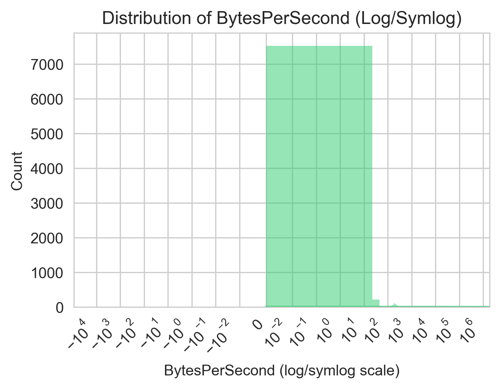
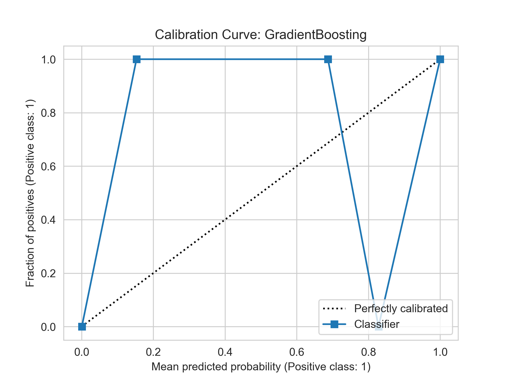
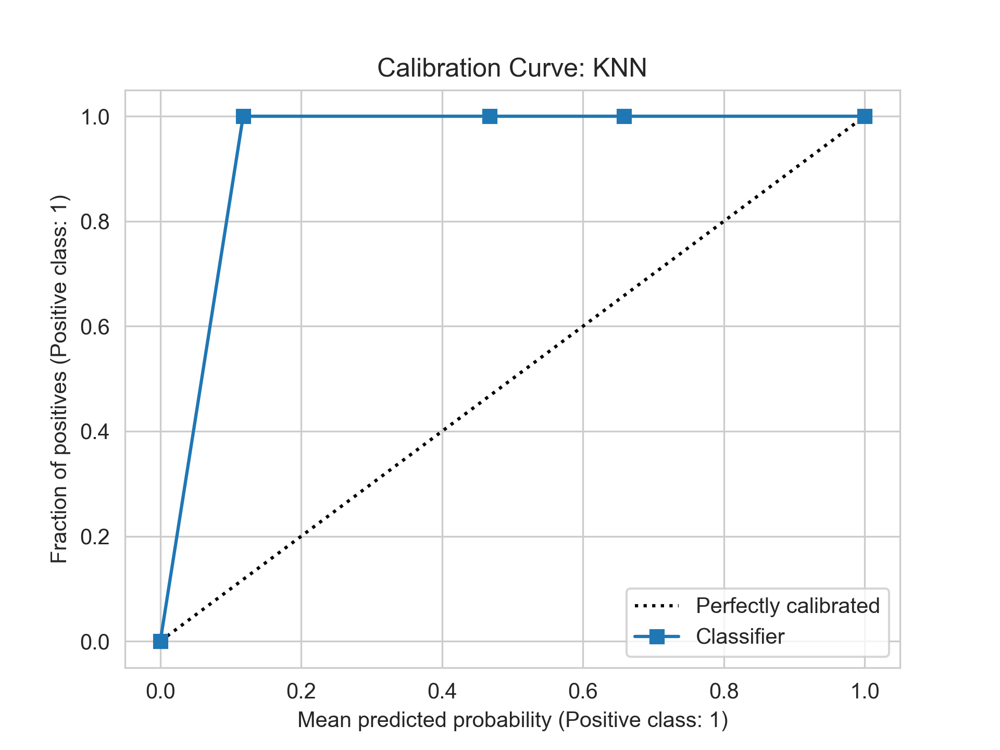

# Network Traffic Analysis for Botnet Detection

**Author:** Michael Stout

# Executive Summary
This project uses machine learning techniques to analyze network traffic data to detect botnet activities. The analysis processed over 107,000 network traffic records, identifying patterns between normal and botnet traffic. The project successfully developed enhanced feature engineering techniques and visualization methods to improve botnet detection accuracy.

# Rationale
Modern cyber threats, particularly botnets and zero-day exploits, pose significant risks to network security. Traditional signature-based detection methods often fail to identify new or evolving threats. Machine learning approaches offer the potential for more adaptive and proactive defense mechanisms, which are crucial for protecting individual users and organizations from emerging cyber threats.

# Research Question
Can machine learning techniques enhance the detection of zero-day exploits and botnet activities within network traffic by looking at network traffic patterns to identify malicious activity?

# Data Sources
This study utilized the [CTU-13 Dataset](https://www.stratosphereips.org/datasets-ctu13#:~:text=The%20CTU%2D13%20is%20a,normal%20traffic%20and%20background%20traffic.), specifically Scenario 11, which is part of a comprehensive botnet capture effort by the Czech Technical University (CTU) in Prague. The CTU-13 dataset is a labeled dataset of botnet, normal, and background traffic captured in 2011 from the CTU University network.

For this analysis, Scenario 11 contained:
- 107,251 total network traffic records  
- 8,164 botnet traffic instances  
- 2,718 normal traffic instances  
- 96,369 background traffic instances  

The dataset represents real botnet traffic mixed with normal traffic and background traffic. Scenario 11 specifically captured the behavior of Rbot, a family of malware known for its backdoor capabilities and use in creating botnets.

Reference:  Sebastian Garcia, Martin Grill, Jan Stiborek and Alejandro Zunino. "An empirical comparison of botnet detection methods," *Computers and Security Journal, Elsevier*. 2014. Vol 45, pp 100-123.

# Scope

This analysis focuses on the **CTU-13 dataset’s Scenario 11** to illustrate how machine learning can detect botnet-related network flows among predominantly background traffic. While Scenario 11 is featured, many of these techniques also generalize across additional CTU-13 scenarios.

# Methodology

### Data Analysis

- Section 1: Import Libraries & Logging
- Section 2: Data Loading & Exploration

### Feature Engineering

- Section 3: Data Cleaning & Feature Engineering
- Section 4: Visualization Plots

### Model Development

- Section 5: Train-Test Split & Multi-Model Pipeline
- Section 6: Model Evaluations

### Best Model Evaluation & Recommendation

- Section 7: Evaluate the best model against all 13 CTU-13 dataset files
---

## Data Analysis

### Section 1: Import Libraries & Logging

At the start of the project, I loaded the necessary Python libraries to load and analyze the dataset. I also implemented logging and set global variables.

### Section 2: Data Loading & Exploration

In this section, I loaded the network traffic data (107,251 records) and explored its structure. 

In my initial analysis, I discovered the following.

1. Dataframe Shape
2. Data Types
3. Traffic Distribution
4. Missing Values
5. Traffic Types
6. Traffic Characteristics

### Dataframe Shape

107251 Records
15 Features

### Data Types

Many columns are typed as generic objects or strings—such as Proto, Dir, State, and the IP address fields. Because machine learning models typically require numeric inputs, these columns need conversion to either categorical (with integer codes) or numeric representations. 

RangeIndex: 107251 entries, 0 to 107250
Data columns (total 15 columns):
 #   Column     Non-Null Count   Dtype  
---  ------     --------------   -----  
 0   StartTime  107251 non-null  object 
 1   Dur        107251 non-null  float64
 2   Proto      107251 non-null  object 
 3   SrcAddr    107251 non-null  object 
 4   Sport      106788 non-null  object 
 5   Dir        107251 non-null  object 
 6   DstAddr    107251 non-null  object 
 7   Dport      99351 non-null   object 
 8   State      107160 non-null  object 
 9   sTos       106271 non-null  float64
 10  dTos       90292 non-null   float64
 11  TotPkts    107251 non-null  int64  
 12  TotBytes   107251 non-null  int64  
 13  SrcBytes   107251 non-null  int64  
 14  Label      107251 non-null  object 
dtypes: float64(3), int64(3), object(9)
memory usage: 12.3+ MB

### Traffic Distribution

| Category  | Metric                                                    |                                          Value |
|:--------- |:--------------------------------------------------------- |----------------------------------------------:|
| Botnet    | Number of unique Botnet source IPs                        | 3                          |
| Botnet    | Number of unique Botnet Targets IPs                       | 9                          |
| Botnet    | Number of Botnet sockets (SrcAddr, Sport, DstAddr, Dport) | 8155                             |
| Normal    | Number of Normal Sockets                                  | 613                             |
| Botnet    | Total Botnet packets                                      | 55504                       |
| Normal    | Total Normal Packets                                      | 29466                       |
| Botnet    | Botnet Packet Size (bytes) [min, mean, max]               | [90.00, 1063.77, 1066.00]  |
| Normal    | Normal Packet Size (bytes) [min, mean, max]               | [60.00, 96.24, 1010.29] |
| Botnet    | Botnet Duration (seconds) [min, mean, max]                | [0.00, 7.86, 416.85] |
| Normal    | Normal Duration (seconds) [min, mean, max]                | [0.00, 7.88, 969.98] |

### Missing Values

- Sport (source port) occasionally not recorded → 463 missing.  
- Dport (destination port) has 7,900 missing entries.  
- State is missing in 91 flows.  
- dTos is missing in 16,959 flows (often unrecorded or irrelevant).  

| Feature    | Nul   |
|:-----------|------:|
| Sport      |   463 |
| Dport      |  7900 |
| State      |    91 |
| sTos       |   980 |
| dTos       | 16959 |

### Traffic Types

There is a significant class imbalance with background dominating.
- Background (blue): 96,369 records (~89.9%)
- Botnet (red): 8,164 records (~7.6%)
- Normal (green): 2,718 records (~2.5%)  

  
   
### Traffic Characteristics

The graph shows three main Botnet source IPs connecting to multiple target IPs and demonstrates the concentrated nature of Botnet flows pivoting to numerous destinations.

  
   
### Time-Based Packets
   
- Background traffic dominates packet volume.
- Botnet (red) shows sharp bursts.
- Normal (green) remains modest in total packets per minute.

  
  
### Time-Based Average Duration

- Botnet flows (red) often remain short but can spike.
- Background (blue) typically has moderate-to-high durations.
- Normal (green) fluctuates but has fewer flows overall.

  

   
## Feature Engineering

### Section 3: Data Cleaning & Feature Engineering

In this section, I focused on refining the original dataset into a more robust feature set by creating new variables and consolidating existing ones. Below is a summary of **key derived features** and their respective graphs.

### DurCategory Counts

By converting numeric duration to categories, we can see that most flows are labeled `very_short`, with very few flows in `short`, `medium`, or `long`. 

Observations

- Dominance of very_short flows: Over 90% fall in this bin, suggesting most connections are extremely brief.  
- Long flows: A smaller subset lasting several minutes to hours.  
- Medium/short flows: These are very rare in this data.  

Despite its value for quick descriptive insights, `DurCategory` typically showed lower importance in predictive models than numeric features.

This feature transforms the continuous `Dur` (duration in seconds) into a set of categorical bins:

| Category    | Count  |
|-------------|-------:|
| very_short  | 10106  |
| long        | 755    |
| medium      | 13     |
| short       | 8      |

### Distribution of BytesPerSecond

BytePktRatio is a derived feature computed as `TotBytes / TotPkts,` which measures the average payload size per packet.

This feature emerged as highly predictive in tree-based models, often overshadowing other variables.

Observations

- Wide range: Values cluster at 60 (low ratio) or 1066 (high ratio).  
- High BytePktRatio can mean large content per packet (e.g., file transfers).
- Low BytePktRatio implies frequent small packets (e.g., chatty protocols).  

| Metric | Value                      |
|:------:|:---------------------------|
| count  | 10882.0                    |
| mean   | 822.1099264102124         |
| std    | 421.45060727454836        |
| min    | 60.0                       |
| 25%    | 292.0                      |
| 50%    | 1066.0                     |
| 75%    | 1066.0                     |
| max    | 1066.0                     |

### Distribution of BytesPerSecond

BytesPerSecond measures total bytes transmitted (in `TotBytes`) divided by connection duration in seconds. This highlights flow intensity (bandwidth usage).

Observations

- Heavily right-skewed: Many flows have near-zero throughput, with only a small fraction hitting high bandwidth.  
- Potential DDoS or exfiltration indicator: Large spikes in BytesPerSecond can flag suspicious traffic.

| Metric | Value                   |
|:------:|:------------------------|
| count  | 10882.0                 |
| mean   | 65707.63308488764       |
| std    | 195364.19446829928      |
| min    | 0.0                     |
| 25%    | 0.0                     |
| 50%    | 0.0                     |
| 75%    | 243.2164971812862       |
| max    | 1748538.0116959063      |

### PktsPerSecond

Similarly, PktsPerSecond captures the total packet overflow duration. This highlights packet-rate intensity rather than total byte volume.

Observations

- Most flows: Very low packet rates, often hitting zero if a flow was extremely short.  
- Outliers: Some flows have extremely high packet bursts, which are useful for detecting flood-style attacks or ephemeral spikes.

| Metric | Value              |
|:------:|:-------------------|
| count  | 10882.0            |
| mean   | 601.4648290374602  |
| std    | 1396.1123327844919 |
| min    | 0.0                |
| 25%    | 0.0                |
| 50%    | 0.0                |
| 75%    | 0.23277560736508965|
| max    | 12987.012987012988 |

### Distribution of SrcAddrEntropy

SrcAddrEntropy* measures the variability of source addresses within a given flow context. High entropy suggests many unique source IP addresses; low entropy indicates a narrower set (e.g., a small botnet or repeated connections from the same IP).

Observations
- Two peaks: The histogram shows at least two distinct modes, hinting at discrete “clusters” of flows with differing source IP diversity.  
- Botnets often exhibit lower IP diversity if only a few infected hosts are active.

| Metric | Value             |
|:------:|:------------------|
| count  | 10882.0           |
| mean   | 2.898843920681802 |
| std    | 0.10173272608708873|
| min    | 2.625814583693911 |
| 25%    | 2.8150724101159437|
| 50%    | 2.8150724101159437|
| 75%    | 3.0269868333592873|
| max    | 3.027169118440619 |

Likewise, DstAddrEntropy indicates the variety of unique destinations a flow group communicates with.

Observations

- Mostly high-entropy flows: Indicating many distinct destinations.  
- Lower-entropy tail: Some flows concentrate on a single or few repeated destinations, possibly indicating targeted scanning or repeated requests.

| Metric | Value                    |
|:------:|:-------------------------|
| count  | 10882.0                  |
| mean   | 2.8619192823547737       |
| std    | 0.04248657782943195      |
| min    | 2.1180782093497093       |
| 25%    | 2.855388542207534        |
| 50%    | 2.855388542207534        |
| 75%    | 2.855388542207534        |
| max    | 3.039148671903071        |

### Section 4: Visualizations

### Pair Plot of Numeric Features
  
- Shows multi-feature relationships (TotPkts, TotBytes, BytesPerSecond, BytePktRatio, etc.) across Normal vs. Botnet classes.  
- Offers a comprehensive view of scatter plots, helping to identify clusters or separations in high-dimensional space.  
- Color-coding by class (Green = Normal, Red = Botnet) makes any distinct clustering immediately visible.
- High separability in features like BytePktRatio and BytesPerSecond: Botnet data often clusters in narrower ranges than Normal.  
- Outliers (especially large BytesPerSecond or TotBytes) typically belong to Normal flows, indicating those might be benign high-throughput connections.  
- Reinforces which numeric variables (e.g., BytePktRatio) are most predictive.

 

### Hierarchically Clustered Correlation Heatmap
  
- Displays feature-to-feature** correlations in a heatmap, with hierarchical clustering grouping similar features together.  
- Helps us reduce redundancy** by spotting highly correlated pairs (e.g., `PktsPerSecond` and `BytesPerSecond` often track each other).  
- Aids feature selection: strongly correlated features can be pruned or combined.
- PktsPerSecond ↔ BytesPerSecond emerges as a clear correlation cluster.  
- BytePktRatio** shows a moderate negative correlation with certain throughput-based features, signifying it captures a different (and complementary) aspect of network traffic.  
- Reveals how entropy features cluster distinctly from packet or byte-based measures.

  

### Botnet vs. Normal Distribution  

- Illustrates the class imbalance within the combined Botnet+Normal subset.  
- Critical for classification tasks, as a severe imbalance can bias or mislead certain models.
- Approximately 8,164 Botnet flows vs. 2,718 Normal flows → ~75% are Botnet in this subset.  
- Class imbalance implies the potential need for weighting or oversampling in certain models.  
- Understanding imbalance is crucial for choosing metrics beyond simple accuracy (e.g., F1-Score, AUC).
  
 

### Count Plot of SportRange by Botnet Label  

- Directly shows how source port usage differs between Normal and Botnet flows.  
- Port usage can be tied to specific protocols or malicious C2 (command-and-control) channels. 
- Botnet flows heavily favor SportRange = 2 (ephemeral range).  
- Normal flows exhibit more diversity, with other port ranges also in use.  
- Highlights an operational trait of botnets: they often rely on ephemeral or registered ports for stealth or agility.

   

### Box Plot of PktsPerSecond by Botnet Label 

- Compares packet rate distributions between classes.  
- Box plots concisely show medians, quartiles, and outliers.
- Normal (green) is widespread, with outliers reaching up to ~12,000 pets/sec (likely short, high-intensity connections).  
- Botnet (red) is mostly near zero, implying frequent low-volume or short bursts.  
- Reinforces that many Botnet flows are short or low in packet count.

### Strip Plot of BytesPerSecond by Botnet Label**  

- Plots each flow for a more granular look than a box plot.  
- Visualizes overlapping data points and the presence of outliers. 
- Normal traffic can surge to extremely high throughput (above 1e6 Bytes/s).  
- Botnet tends to cluster near zero or in certain discrete bandwidth tiers.  
- Detects rare but high Botnet outliers, reinforcing the heterogeneous nature of malicious traffic.

 

### Violin Plot of BytesPerSecond by Botnet Label  

- Combines a box plot with a kernel density estimate, providing distribution shape and quartile summary.  
- Useful for seeing how data is “spread” within each class.
- Normal flows form a broad “violin,” reflecting many different throughput values.  
- Botnet is narrow (mostly near zero), with few flows at extremely high B/s.  
- Underscores that most Botnet flows are short and low-volume, matching the findings in other plots.

 

### Summary of Visualizations

1. **Pair Plot** – Provides **broadest** multi-feature separation view; ideal for seeing clustering by class.  
2. **Correlation Heatmap** – Critical for **feature engineering** decisions (redundancy, synergy).  
3. **Botnet vs Normal Distribution** – Clarifies **class imbalance**, essential for model metric choice.  
4. **Count Plot (SportRange)** – Highlights **port usage** differences; a strong domain insight for identifying malicious behavior.  
5. **Box Plot (PktsPerSecond)** – Quickly compares distribution shapes and outliers per class.  
6. **Strip Plot (BytesPerSecond)** – Granular look at each flow’s throughput, revealing outliers.  
7. **Violin Plot (BytesPerSecond)** – Density-based distribution reveals how concentrated Botnet flows are near zero.

### Section 5: Train-Test Split & Multi-Model Pipeline

In our botnet-detection workflow, engineered features such as BytePktRatio (dominant), BytesPerSecond, PktsPerSecond**, SrcAddrEntropy, DstAddrEntropy, and DurCategory were integrated into an 80/20 train/test split. These features address skewed distributions and help capture short-burst or repetitive IP patterns indicative of malicious traffic. Below is a summary of the split details and the specific pipeline configurations and hyperparameters used for each model.

### Train/Test Split Details

- Split Ratio:** ~80% train, ~20% test  
- Train Set Shape: 8,705 rows × 15 columns  
- Test Set Shape: 2,177 rows × 15 columns  

During this split, I ensured:

1. All Features Are Numeric: Categorical variables (e.g., `Proto`, `Dir`, `State`, and `DurCategory`) were converted into integer codes.  
2. Class Distribution Maintenance: The primary labels are Botnet vs Normal, with Botnet ~75% of the combined subset. This imbalance can affect some models if not considered carefully.  
3. Feature Engineering Integration:  
   - BytePktRatio (dominant predictor)  
   - BytesPerSecond, PktsPerSecond (highly skewed, used log/symlog scaling in plots)  
   - SrcAddrEntropy, DstAddrEntropy (IP diversity metrics)  
   - DurCategory (bins of short/medium/long durations, less impactful in final models but useful descriptively)

### Model Pipelines

After creating the train/test split, each model was wrapped in a GridSearchCV pipeline, ensuring that any preprocessing, categorical encoding, and model training were performed consistently. Below are the pipeline details for each classifier:

1. RandomForest  
   - Pipeline Steps:
     1. Categorical encoding for fields like Proto, Dir, etc.  
     2. Random Forest classifier with GridSearchCV tuning:  
        - max_depth  
        - min_samples_split  
        - min_samples_leaf  
        - n_estimators  
   - Benefit: Automatically handles skewed distributions and ranks features by importance. In this task, it highlighted BytePktRatio among top variables.

2. DecisionTree  
   - Pipeline Steps:
     1. Categorical encoding  
     2. Decision Tree with parameter grid on:
        - max_depth  
        - min_samples_split  
        - min_samples_leaf  
   - Benefit: Interpretable rules can reveal if short flows (low BytePktRatio) strongly classify as Botnet.

3. NaiveBayes  
   - Pipeline Steps:
     1. Categorical encoding  
     2. GaussianNB (or similar) with var_smoothing grid  
   - Benefit: Fast training even with skewed data. Notable for near-perfect classification on this data.

4. KNN  
   - Pipeline Steps:
     1. Categorical encoding  
     2. K-Nearest Neighbors with GridSearchCV over:
        - n_neighbors  
        - weights (uniform or distance)  
   - Benefit: Simple, instance-based method. It often requires scaled features but still performs exceptionally with the derived traffic attributes.

5. SVM  
   - Pipeline Steps:
     1. Categorical encoding  
     2. Support Vector Machine (linear or RBF) with GridSearchCV:
        - C  
        - kernel  
   - Benefit: Finds a hyperplane separating Botnet vs Normal. BytePktRatio heavily influences class separation.

6. LogisticRegression  
   - Pipeline Steps:
     1. Categorical encoding  
     2. Logistic Regression with GridSearchCV:
        - C  
        - penalty (L1, L2)  
   - Benefit: Provides coefficient-based interpretability. It often shows BytePktRatio or BytesPerSecond with large magnitudes.

7. GradientBoosting  
   - Pipeline Steps:
     1. Categorical encoding  
     2. Gradient Boosted Trees with GridSearchCV:
        - n_estimators  
        - max_depth  
        - learning_rate  
   - Benefit: Powerful ensemble that refines weak learners iteratively. Typically identifies BytePktRatio as critical for classification.

### Analysis and Observations

- BytePktRatio proved dominant for distinguishing Botnet from Normal traffic, consistently surfacing as a top feature in tree-based models.  
- Skewed metrics (BytesPerSecond, PktsPerSecond) demanded transformations (log scales in plots) but still aided classification by revealing short-burst vs high-throughput patterns.  
- Entropy (SrcAddr, DstAddr) offered moderate predictive power, highlighting repetitive IP usage.  
- DurCategory was more of a descriptive indicator, less impactful in final classifier performance.  
- Models like RandomForest, DecisionTree, and GradientBoosting effectively leveraged these engineered features, each achieving near-perfect recall on detecting botnet flows.

This combined approach of a proper train/test split (with numeric encoding and hyperparameter tuning) and well-engineered features produced high-confidence classification metrics for Botnet traffic, addressing data imbalance and subtle differences between malicious and normal flows.

# Section 6: Model Evaluations

## Evaluation Criteria

The cleaned dataset was run through the above model and evaluated on:

* **Accuracy**
* **Precision, Recall, F1 Score**
* **Log Loss**
* **ROC AUC**
---
    
## Naive Bayes

  
### Confusion Matrix

Out of 2,177 test samples, the classifier misclassifies only 3 of the botnet flows (false negatives) and 0 normal flows (false positives).  

Overall accuracy remains exceptionally high, with near-perfect precision for normal class.

  

  
### Precision-Recall Curve

Precision remains ~1.0 for a broad range of recall values, only dropping slightly at the highest recall levels (near 100%).  

Implies extremely few false positives or false negatives over most decision thresholds.

  

  
### ROC Curve

The AUC (Area Under the Curve) is **1.00**, showing perfect separability on this test set.  

Despite its simplifying assumptions, it confirms that Naive Bayes effectively distinguishes botnet from normal traffic in this scenario.

  

  
### Calibration Curve

The calibration line (blue squares) closely follows the diagonal, indicating the Naive Bayes probability outputs are well-aligned with true outcome frequencies.  

In many ML scenarios, Naive Bayes probabilities can be skewed, but here they appear quite reliable.

  

  
### Gains Chart

Highlights that by focusing on the top portion of flows ranked by predicted probability, almost all botnet flows are identified with minimal total traffic to review.  

Very similar to the near-vertical rise seen with other high-performing models.

  

  
### Top Ten Features

Naive Bayes does not include a feature importance mechanism since it operates under the assumption of conditional independence between features. It does not weigh features beyond their contributions to class likelihoods.

  
### Strengths of Naive Bayes

- **Speed & Simplicity**: Very fast to train and straightforward to implement.  
- **Well-Calibrated Probabilities**: In this dataset, the predicted probabilities align well with observed frequencies (see calibration curve).

  
### Weaknesses of Naive Bayes

- **Strong Independence Assumption**: Assume features are conditionally independent and may not hold in all real-world datasets.  
- **No Direct Feature Importance**: The standard approach does not provide a built-in `feature_importances_` or coefficient-based ranking.

---

  
## Logistic Regression

  
### Confusion Matrix

Out of 2,177 test samples, the model misclassifies **1 normal flow** (false positive) and **2 botnet flows** (false negatives).  

Overall performance is still exceptionally high, with only a handful of errors.

  

  
### Precision-Recall Curve

Maintains near-perfect precision until recall nears 100%, signifying minimal false positives.  

Very high recall with few missed botnet flows.

  

  
### ROC Curve

The AUC is **1.00**, indicating complete separation of botnet vs. normal in this test set.  

Logistic Regression identifies the majority of flows correctly with very few misclassifications.

  

  
### Calibration Curve

The predicted probabilities are somewhat under-confident for low-probability flows (under 0.2) and over-confident for higher probabilities. 

Overall alignment is still decent, but there is room for more precise calibration if needed.

  

  
### Gains Chart

Similar to other high-performing models, the cumulative gains approach 1.0 quickly, indicating a small fraction of top flows contain the majority of botnet traffic.  

Scoring flows by LogisticRegression probability is effective for prioritizing suspicious connections.

  

  
### Top Ten Features

  

- **Analysis**:  
  - **SrcBytes**, **TotBytes**, and **TotPkts** show the largest absolute coefficient values, strongly influencing log-odds of a flow being botnet vs. normal.  
  - **BytePktRatio** is also substantial, highlighting the ratio of bytes to packets as a key factor.  
  - Additional features (e.g., `State`, `Proto`, `SrcAddrEntropy`) also provide predictive power.

  
### Strengths of Logistic Regression

- **Interpretability**: Provides direct insight into how each feature influences classification via positive/negative coefficients.  
- **Efficiency**: Generally fast to train, even with large datasets.  
- **Probability Outputs**: Offers straightforward probability scores (which can be further calibrated if needed).

  
### Weaknesses of Logistic Regression

- **Linear Decision Boundary**: This may underfit if the relationships between features and targets are highly non-linear.  
- **Feature Engineering**: Often requires careful feature transformations or interactions to capture complex patterns.

---

  
## Gradient Boosting

  
### Confusion Matrix

Out of 2,177 test samples, only **3 flows** are misclassified (2 normal flows flagged as botnet, 1 botnet flow flagged as normal).  

Overall performance is near-perfect, consistent with other high-performing models.

  

  
### Precision-Recall Curve

Precision remains ~1.0 until recall pushes near 100%.  

Very few false positives or false negatives, consistent with high recall and high precision.

  

  
### ROC Curve

The AUC is **1.00**, confirming the model’s ability to separate botnet vs. normal traffic with almost no overlap.  

Extremely high true-positive and low false-positive rates across thresholds.

  

  
### Calibration Curve

The model’s probabilities tend to cluster around extremes (near 0 or 1), as shown by the zig-zag line.  

While classification is very accurate, the probability estimates are less smoothly calibrated (similar to RandomForest).

  

  
### Gains Chart

Nearly all botnet instances are identified within the top ~20% of flows sorted by predicted botnet probability.  

Demonstrates strong utility for prioritizing suspicious flows.

  

  
### Top Ten Features

  

- **Analysis**:  
  - **BytePktRatio** dominates, suggesting the ratio of bytes to packets is the primary factor.  
  - Other features (e.g., `SrcAddrEntropy,` `SrcBytes,` `DstAddrEntropy`) appear but have a smaller relative impact.  
  - The model focuses heavily on a few strongly predictive splits.

  
### Strengths of Gradient Boosting

- **High Predictive Power**: Sequentially corrects errors of weaker learners, often outperforming simpler models.  
- **Versatile**: Can handle many data types and distribution shapes; hyperparameter tuning offers extensive control.  
- **Captures Non-Linearities**: Building many shallow trees helps model complex decision boundaries.

  
### Weaknesses of Gradient Boosting

- **Overfitting Risk**: Must carefully tune parameters (learning rate, tree depth) to avoid memorizing training data.  
- **Slower Training**: More computationally expensive than single-tree methods due to iterative nature.  
- **Less Interpretable**: Ensemble structure is harder to visualize than a single decision tree.

---

  
## Support Vector Machine (SVM)

  
### Confusion Matrix

Of 2,177 test samples, **2** botnet flows are misclassified (false negatives), with **0** normal flows misclassified.  

Delivers near-perfect performance, aligning with the other top models.

  

  
### Precision-Recall Curve

Precision remains ~1.0 from low recall up to nearly 100%, signifying extremely few false positives.  

The curve only drops right at the edge, aligning with near-perfect detection.

  

  
### ROC Curve

The AUC is **1.00**, indicating a complete separation between botnet and normal classes in this test set.  

SVM’s linear kernel identifies both classes with minimal error.

  

  
### Calibration Curve

The classifier probabilities are well aligned with the ideal diagonal, though imperfect.  

SVMs often need additional calibration (e.g., Platt scaling) to refine probability estimates.

  

  
### Gains Chart

By focusing on the top fraction of flows ranked by predicted botnet probability, nearly all flows are captured quickly.  

Gains approach 100% after reviewing ~20% of flows.

  

  
### Top Ten Features

  

- **Analysis**:  
  - **SrcBytes** and **TotPkts** have the largest absolute coefficients, strongly influencing the linear decision boundary.  
  - **BytePktRatio**, **TotBytes**, and **SrcAddrEntropy** also appear prominently.

  
### Strengths of SVM

- **Effective in High-Dimensional Spaces**: Can handle many features well, with optional kernel tricks for complex boundaries.  
- **Robust Margins**: Maximizes class margin, leading to strong generalization if data is well-separated.

  
### Weaknesses of SVM

- **Tuning Complexity**: Choosing kernel, `C` value and other parameters requires significant trial-and-error or grid search.  
- **Less Intuitive Probabilities**: Default SVMs don’t produce probability estimates; calibration is often required.  
- **Computation Time**: Can be slower for very large datasets or certain kernels.

---

  
## Decision Tree

  
### Confusion Matrix

Of 2,177 test samples, **1 total flow** is misclassified (1 false positive, 0 false negatives).  

Nearly perfect classification, reflecting the tree’s ability to separate normal (0) from botnet (1).

  

  
### Precision-Recall Curve

Precision and Recall remain at or near **1.0** for essentially all thresholds.  

Denotes minimal false positives and false negatives.

  

  
### ROC Curve

The AUC is **1.00**, indicating a perfectly separable classification boundary on this test set.  

It confirms that the Decision Tree can almost entirely distinguish the two classes.

  

  
### Calibration Curve

Predicted probabilities align nearly perfectly with the diagonal line.  

Indicates that Decision Tree outputs (for this dataset) are well-calibrated.

  

  
### Gains Chart

Nearly all botnet flows are captured by selecting the top fraction of flows with the highest predicted botnet probability.  

Approaches 100% of botnet flows by reviewing ~20-25% of total traffic.

  

  
### Top Ten Features

  

- **Analysis**:  
  - **BytePktRatio** overwhelmingly dominates feature importance, so most splits rely on the ratio of bytes to packets.  
  - Other features (e.g., `SrcAddrEntropy`, `SrcBytes`) have minimal influence here.

  
### Strengths of Decision Tree

- **Interpretability**: A single tree can be visualized for direct insights into splits.  
- **Fast Training**: Typically faster than ensemble methods (like Random Forest).

  
### Weaknesses of Decision Tree

- **Overfitting Risk**: A tree can memorize training data without pruning or parameter tuning.  
- **Single-Feature Dominance**: One feature can dominate, potentially obscuring nuanced patterns.

---

  
## Random Forest

  
### Confusion Matrix

Of 2,177 test samples, **3 total flows** are misclassified (2 false positives, 1 false negative).  

Achieves near-perfect performance for both classes.

  

  
### Precision-Recall Curve

Precision and Recall remain extremely high, near **1.0** across all thresholds.  

Reinforces that false positives or false negatives are minimal.

  

  
### ROC Curve

The AUC is **1.00**, indicating perfect separation of botnet vs. normal flows in the test set.

  

  
### Calibration Curve

The curve deviates from the perfectly calibrated line, showing probabilities that are often extreme (0 or 1).  

While accurate, Random Forest can benefit from probability calibration.

  

  
### Gains Chart

Cumulative gains approach 1.0 very quickly.  

In practice, nearly all botnet flows are captured by reviewing the top ~20% of predicted probabilities.

  

  
### Top Ten Features

  

- **Analysis**:  
  - **SrcBytes** is the most important feature, followed by **TotBytes**, **BytePktRatio**, and **BytesPerSecond**.  
  - It reflects that the volume/ratio of traffic heavily influences classification.

  
### Strengths of Random Forest

- **High Predictive Accuracy**: An ensemble of trees effectively captures complex patterns.  
- **Feature Importance**: Provides interpretable measures (e.g., `SrcBytes`, `TotBytes`) to guide analysis.  
- **Robustness**: Less prone to overfitting than a single decision tree.

  
### Weaknesses of Random Forest

- **Model Complexity**: The large ensemble can affect storage and prediction speed.  
- **Probability Calibration**: Often yields near-0 or near-1 probabilities without additional calibration.

---

  
## K-Nearest Neighbors (KNN)

  
### Confusion Matrix

Out of 2,177 test samples, KNN misclassifies **2** botnet flows (false negatives) and **0** normal flows.  

An extremely low error rate.

  

  
### Precision-Recall Curve

Precision and Recall remain at or near **1.0** across most thresholds.  

Very few misclassifications in either direction.

  

  
### ROC Curve

The AUC is **1.00**, indicating complete separability of botnet vs. normal in this test set.  

The perfect true-positive rate at ~0% false positives.

  

  
### Calibration Curve

KNN probabilities tend to be extreme (0 or 1), as shown by the curve hugging the top axis.  

While classification is very accurate, the probability estimates are less smoothly calibrated.

  

  
### Gains Chart

Identifies nearly all botnet flows after reviewing the top ~20% of predicted probabilities.  

Exhibits the same near-vertical rise as other best-performing models.

  

  
### Top Ten Features

KNN does not inherently provide a feature-importance mechanism, as classification is distance-based rather than feature-weight-based.

  
### Strengths of KNN

- **Non-Parametric**: No explicit training phase; classification is based on nearest neighbors.  
- **High Accuracy**: Performs extremely well when classes are well-separated by distance.  
- **Intuitive**: The concept of “neighbor votes” is straightforward.

  
### Weaknesses of KNN

- **Computational Cost**: Distance to many training points must be computed at prediction time.  
- **Feature Scaling Sensitivity**: Requires careful normalization to avoid skewed distances.  
- **No Direct Feature Importance**: All features contribute equally unless manually weighted.

### Evaluating the Models

KNN is the best-performing model because it achieves near-perfect performance across multiple metrics, including a perfect precision of 1.0 and a high recall of 0.9988. It also yields an ROC AUC of 1.0 and an mAP (mean Average Precision) of 1.0, indicating it separates Botnet from Normal flows more consistently than the other models in this dataset.

Since the dataset is imbalanced (Botnet flows outnumber Normal flows by about 3:1), the best metric to compare models here is typically one that balances precision and recall, such as F1 score (or closely related metrics like PR AUC/mAP). A high F1 means the model reliably detects Botnet flows without too many false alarms. Although accuracy is high for most models, it can be misleading when imbalanced classes; hence, F1 or mAP are more robust measures for this task.

In this table, KNN maintains perfect precision and very few missed Botnet flows (high recall), leading to an F1 near 0.9994. Combining that with a perfect ROC AUC and mAP underscores KNN’s ability to separate classes with minimal error—even in an imbalanced setting—makes it the top model for Botnet detection.

| Model              | best_params                                                                                              |   train_time_sec |    cv_f1 |   test_accuracy |   test_precision |   test_recall |   test_f1 |   specificity |   test_roc_auc |   log_loss |      mAP | confusion_matrix   |
|:-------------------|:---------------------------------------------------------------------------------------------------------|-----------------:|---------:|----------------:|-----------------:|--------------:|----------:|--------------:|---------------:|-----------:|---------:|:-------------------|
| RandomForest       | {'clf__max_depth': 10, 'clf__min_samples_leaf': 1, 'clf__min_samples_split': 5, 'clf__n_estimators': 50} |        2.69593   | 0.999004 |        0.998622 |         0.998776 |      0.999388 |  0.999082 |      0.996324 |       0.999993 | 0.00244824 | 0.999998 | [[ 542    2]       |
|                    |                                                                                                          |                  |          |                 |                  |               |           |               |                |            |          |  [   1 1632]]      |
| DecisionTree       | {'clf__max_depth': 10, 'clf__min_samples_leaf': 1, 'clf__min_samples_split': 2}                          |        0.0937662 | 0.998699 |        0.999541 |         0.999388 |      1        |  0.999694 |      0.998162 |       0.999081 | 0.0165566  | 0.999388 | [[ 543    1]       |
|                    |                                                                                                          |                  |          |                 |                  |               |           |               |                |            |          |  [   0 1633]]      |
| NaiveBayes         | {'clf__var_smoothing': 1e-09}                                                                            |        0.0405741 | 0.998543 |        0.998622 |         1        |      0.998163 |  0.999081 |      1        |       0.998571 | 0.0496697  | 0.999609 | [[ 544    0]       |
|                    |                                                                                                          |                  |          |                 |                  |               |           |               |                |            |          |  [   3 1630]]      |
| KNN                | {'clf__n_neighbors': 5, 'clf__weights': 'distance'}                                                      |        0.222822  | 0.99885  |        0.999081 |         1        |      0.998775 |  0.999387 |      1        |       1        | 0.00155686 | 1        | [[ 544    0]       |
|                    |                                                                                                          |                  |          |                 |                  |               |           |               |                |            |          |  [   2 1631]]      |
| SVM                | {'clf__C': 10.0, 'clf__kernel': 'linear'}                                                                |        0.93003   | 0.999081 |        0.999081 |         1        |      0.998775 |  0.999387 |      1        |       0.99892  | 0.00974327 | 0.999722 | [[ 544    0]       |
|                    |                                                                                                          |                  |          |                 |                  |               |           |               |                |            |          |  [   2 1631]]      |
| LogisticRegression | {'clf__C': 10, 'clf__penalty': 'l1'}                                                                     |        0.720791  | 0.998544 |        0.998622 |         0.999387 |      0.998775 |  0.999081 |      0.998162 |       0.999929 | 0.00586066 | 0.999977 | [[ 543    1]       |
|                    |                                                                                                          |                  |          |                 |                  |               |           |               |                |            |          |  [   2 1631]]      |
| GradientBoosting   | {'clf__learning_rate': 0.1, 'clf__max_depth': 3, 'clf__n_estimators': 100}                               |        1.27693   | 0.999234 |        0.998622 |         0.998776 |      0.999388 |  0.999082 |      0.996324 |       0.999995 | 0.00298092 | 0.999999 | [[ 542    2]       |
|                    |                                                                                                          |                  |          |                 |                  |               |           |               |                |            |          |  [   1 1632]]      |

### Best Model Evaluation & Recommendation

## Section 7: Evaluate KNN against all 13 CTU-13 dataset files

| Dataset                           |   TrainTimeSec |   Accuracy |   Precision |   Recall |       F1 |   Specificity |     LogLoss |      mAP |   ROC_AUC | ConfusionMatrix                |
|:----------------------------------|---------------:|-----------:|------------:|---------:|---------:|--------------:|------------:|---------:|----------:|:-------------------------------|
| 1-Neris-20110810.binetflow.csv    |    0.0147202   |   0.99979  |    0.999878 | 0.999756 | 0.999817 |      0.999835 | 0.00279375  | 0.999878 |  0.999918 | [[6077    1]  [   2 8190]]     |
| 2-Neris-20110811.binetflow.csv    |    0.00541782  |   0.999667 |    0.999523 | 1        | 0.999761 |      0.998904 | 0.00658446  | 0.999761 |  0.999726 | [[1822    2]  [   0 4189]]     |
| 3-Rbot-20110812.binetflow.csv     |    0.0310211   |   1        |    1        | 1        | 1        |      1        | 3.15146e-05 | 1        |  1        | [[23378     0]  [    0  5364]] |
| 4-Rbot-20110815.binetflow.csv     |    0.00527096  |   1        |    1        | 1        | 1        |      1        | 0.000155249 | 1        |  1        | [[5054    0]  [   0  516]]     |
| 5-Virut-20110815-2.binetflow.csv  |    0.000983953 |   1        |    1        | 1        | 1        |      1        | 2.22045e-16 | 1        |  1        | [[936   0]  [  0 180]]         |
| 6-Menti-20110816.binetflow.csv    |    0.0021348   |   1        |    1        | 1        | 1        |      1        | 0.000582949 | 1        |  1        | [[1499    0]  [   0  926]]     |
| 7-Sogou-20110816-2.binetflow.csv  |    0.000360966 |   1        |    1        | 1        | 1        |      1        | 0.0016563   | 1        |  1        | [[335   0]  [  0  13]]         |
| 8-Murlo-20110816-3.binetflow.csv  |    0.0167248   |   0.999937 |    1        | 0.999184 | 0.999592 |      1        | 5.13427e-05 | 1        |  1        | [[14565     0]  [    1  1224]] |
| 9-Neris-20110817.binetflow.csv    |    0.0577488   |   0.976995 |    0.983148 | 0.990243 | 0.986682 |      0.895211 | 0.29856     | 0.992396 |  0.97534  | [[ 5365   628]  [  361 36637]] |
| 10-Rbot-20110818.binetflow.csv    |    0.023664    |   0.999304 |    0.999765 | 0.999436 | 0.9996   |      0.998422 | 0.0129311   | 0.99991  |  0.999672 | [[ 3164     5]  [   12 21259]] |
| 11-Rbot-20110818-2.binetflow.csv  |    0.00182605  |   0.999081 |    1        | 0.998775 | 0.999387 |      1        | 0.00168051  | 1        |  0.999999 | [[ 544    0]  [   2 1631]]     |
| 12-NsisAy-20110819.binetflow.csv  |    0.00232887  |   0.977551 |    0.962085 | 0.935484 | 0.948598 |      0.989515 | 0.253078    | 0.974369 |  0.985308 | [[1510   16]  [  28  406]]     |
| 13-Virut-20110815-3.binetflow.csv |    0.014365    |   0.999722 |    0.999875 | 0.999625 | 0.99975  |      0.999843 | 0.00281726  | 0.999944 |  0.999937 | [[6387    1]  [   3 7998]]     |

### **Overall Observations**
- **High Accuracy and Precision:**  
  In nearly all datasets, KNN achieves near-perfect performance—often with **100% precision** and extremely high recall. This indicates it seldom misclassifies benign (Normal) traffic as Botnet, which is crucial for reducing false alarms.

- **Almost Perfect in Most Cases:**  
  Datasets like **Rbot (20110812, 20110815, 20110818)**, **Virut (20110815-2, 20110815-3)**, **Menti (20110816)**, **Sogou (20110816-2)**, and **Murlo (20110816-3)** show **100% accuracy** (or near-perfect). The confusion matrices consistently reveal either zero or just a handful of misclassifications.

- **Slight Dip in a Few Cases:**
  - **Neris (20110817):**  
    Accuracy dips to ~**97.70%**. Though still high, the recall is **0.9902**, indicating a handful of Botnet flows were missed (**361 false negatives**).
  - **NsisAy (20110819):**  
    Accuracy is ~**97.76%**, with precision at **0.962** and recall at **0.935**. This is a slight decline relative to other sets but remains robust.

Despite these minor reductions, KNN still achieves F1 scores above **0.94** in every scenario. The mean Average Precision (**mAP**) and ROC AUC also remain excellent (often at or near **1.0**), underscoring KNN’s strong ability to separate Botnet from Normal flows across multiple botnet families.

---

### **Dataset-by-Dataset Highlights**

1. **1-Neris-20110810**
   - **Accuracy:** 0.99979  
   - **Precision:** 0.999878  
   - **Recall:** 0.999756  
   - **F1:** 0.999817  
   - *Explanation:* Extremely close to perfect scores indicate KNN easily distinguished the Neris botnet from background traffic.

2. **2-Neris-20110811**
   - **Accuracy:** 0.999667  
   - *Perfect recall* (1.0) with near-perfect precision (0.999523).  
   - Only 2 flows are incorrectly labeled.

3. **3-Rbot-20110812, 4-Rbot-20110815**
   - *Flawless performance* (**100% accuracy**, precision, recall, F1).  
   - Consistently zero false positives/negatives.

4. **5-Virut-20110815-2, 13-Virut-20110815-3**
   - Both have *perfect or near-perfect metrics*, highlighting KNN’s generalizability to different Botnet variants (**Virut** in this case).

5. **8-Murlo-20110816-3**
   - **Accuracy:** 0.999937  
   - **F1:** 0.999592  
   - Only 1 Botnet flow was misclassified among nearly 16,000 flows.

6. **9-Neris-20110817**
   - **Accuracy:** 0.976995  
   - **F1:** 0.986682  
   - Slightly more challenging; a few hundred more flows mislabeled than in earlier sets.
   - *Specificity* (**0.895211**) indicates KNN occasionally flagged Normal flows as Botnet.

7. **12-NsisAy-20110819**
   - **Accuracy:** 0.977551  
   - **F1:** 0.948598  
   - The biggest drop in recall (**0.935**). This type of traffic seems more challenging, possibly due to narrower distinctions from Normal traffic or data distribution differences.

---

### **Why KNN Performs Well Across These Sets**

1. **Distance-Based Similarities:**  
   With robust feature engineering (*BytePktRatio*, *BytesPerSecond*, etc.), Botnet flows cluster closely in feature space, making them distinct from Normal points.

2. **High-Dimensional Separation:**  
   KNN leverages local neighborhoods effectively. As long as malicious flows cluster together in feature space, KNN can classify them accurately—even with imbalanced data.

3. **Consistency of Botnet Signatures:**  
   Many botnet families exhibit repetitive patterns (e.g., short bursts of activity and minimal payloads). Once trained on these patterns, KNN flags them reliably.

---

### **Concluding Remarks**

- KNN’s performance remains exceptional across multiple botnet captures, maintaining near-perfect or perfect metrics in most cases.
- A few datasets (notably the Neris-20110817 and NsisAy-20110819 captures) show it can drop slightly below 98% accuracy or ~0.95 F1 score.
- Overall detection remains extremely strong, indicating that:
  - KNN is highly effective at identifying and isolating malicious network flows across various botnet variants.
  - Well-chosen features that capture traffic volume, packet patterns, and IP diversity are critical for its success.
